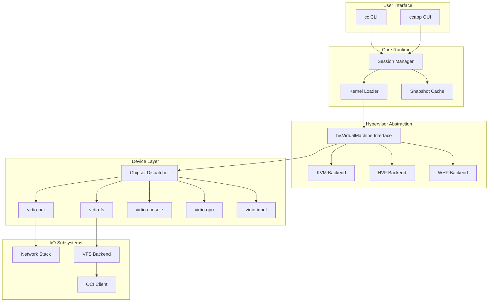
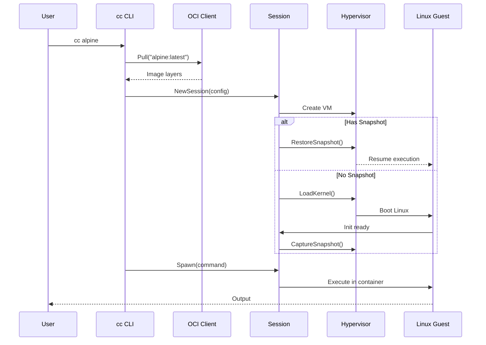
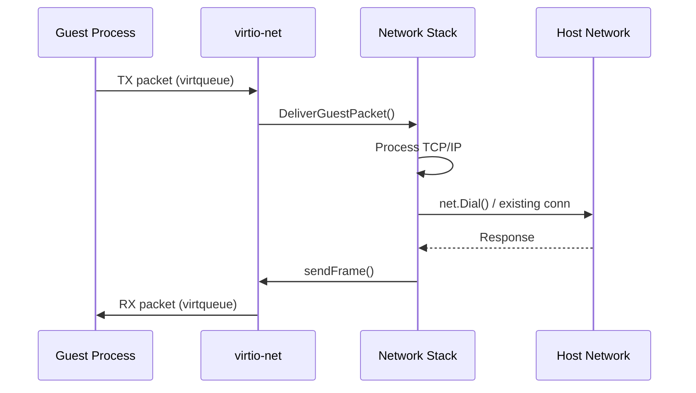

# System Overview

CrumbleCracker is an experimental, high-performance embedded virtual machine monitor (VMM) written in Go. This document provides a high-level overview of the system architecture and design philosophy.

## Design Goals

1. **Performance**: Sub-second container startup via snapshot support
2. **Simplicity**: Minimal external dependencies, self-contained binaries
3. **Portability**: Single codebase supporting Linux, macOS, and Windows
4. **Embeddability**: Library-first design for Go application integration
5. **OCI Compatibility**: Direct container image support without Docker runtime

## System Architecture



## Component Responsibilities

### User Interface Layer

| Component | Location | Purpose |
|-----------|----------|---------|
| cc CLI | [`internal/cmd/cc/`](../../internal/cmd/cc/) | Command-line VM runner |
| ccapp GUI | [`cmd/ccapp/`](../../cmd/ccapp/) | Cross-platform GUI application |

### Core Runtime

| Component | Location | Purpose |
|-----------|----------|---------|
| Session Manager | [`internal/initx/session.go`](../../internal/initx/session.go) | Orchestrates VM lifecycle |
| Kernel Loader | [`internal/initx/loader.go`](../../internal/initx/loader.go) | Loads Linux kernels into VMs |
| Snapshot Cache | [`internal/initx/snapshot_cache.go`](../../internal/initx/snapshot_cache.go) | Caches boot snapshots |

### Hypervisor Abstraction

| Component | Location | Purpose |
|-----------|----------|---------|
| Common Interface | [`internal/hv/common.go`](../../internal/hv/common.go) | Platform-independent abstractions |
| KVM Backend | [`internal/hv/kvm/`](../../internal/hv/kvm/) | Linux KVM implementation |
| HVF Backend | [`internal/hv/hvf/`](../../internal/hv/hvf/) | macOS Hypervisor Framework |
| WHP Backend | [`internal/hv/whp/`](../../internal/hv/whp/) | Windows Hypervisor Platform |

### Device Layer

| Component | Location | Purpose |
|-----------|----------|---------|
| Chipset | [`internal/chipset/`](../../internal/chipset/) | Device registration and I/O dispatch |
| Virtio Devices | [`internal/devices/virtio/`](../../internal/devices/virtio/) | Virtual I/O device implementations |

### I/O Subsystems

| Component | Location | Purpose |
|-----------|----------|---------|
| Network Stack | [`internal/netstack/`](../../internal/netstack/) | TCP/IP implementation |
| VFS Backend | [`internal/vfs/`](../../internal/vfs/) | Virtual filesystem for guests |
| OCI Client | [`internal/oci/`](../../internal/oci/) | Container image pulling and caching |

## Data Flow

### Container Startup Flow



### I/O Flow (Network)



## Key Abstractions

### Hypervisor Interface

The [`hv.VirtualMachine`](../../internal/hv/common.go:458) interface provides a platform-independent abstraction:

```go
type VirtualMachine interface {
    io.ReaderAt
    io.WriterAt
    io.Closer
    MemorySize() uint64
    MemoryBase() uint64
    Run(ctx context.Context, cfg RunConfig) error
    SetIRQ(irqLine uint32, level uint32) error
    AddDevice(dev Device) error
    AllocateMemory(physAddr, size uint64) ([]byte, error)
    AllocateMMIO(req MMIOAllocationRequest) (MMIOAllocation, error)
    CaptureSnapshot() (Snapshot, error)
    RestoreSnapshot(snap Snapshot) error
    // ... additional methods
}
```

### Device Interface

Devices implement the [`hv.Device`](../../internal/hv/common.go:333) interface:

```go
type Device interface {
    Init(vm VirtualMachine) error
}

// Optional interfaces for different I/O types
type MemoryMappedIODevice interface {
    Device
    GetMMIORegions() []MMIORegion
    ReadMMIO(ctx ExitContext, addr uint64, data []byte) error
    WriteMMIO(ctx ExitContext, addr uint64, data []byte) error
}
```

### VirtioDevice Interface

Virtio devices implement [`virtio.VirtioDevice`](../../internal/devices/virtio/device.go:10):

```go
type VirtioDevice interface {
    DeviceID() uint16
    DeviceFeatures() uint64
    MaxQueues() uint16
    ReadConfig(ctx hv.ExitContext, offset uint16) uint32
    WriteConfig(ctx hv.ExitContext, offset uint16, val uint32)
    Enable(features uint64, queues []*VirtQueue)
    Disable()
}
```

## Design Tradeoffs

### Custom Network Stack vs TAP Devices

**Decision**: Implement a custom TCP/IP stack instead of using system TAP devices.

**Rationale**:
- No kernel module dependencies or root privileges
- Cross-platform consistency
- Direct hypervisor integration without context switches
- Simplified deployment (single binary)

**Tradeoffs**:
- Limited protocol support (IPv4 only, no fragmentation)
- Simplified TCP (no advanced congestion control)
- Higher maintenance burden

### IR-Based Init Generation vs Embedded Assembly

**Decision**: Use RTG (Runtime Textual Generation) to compile Go-like source to IR, then to architecture-specific assembly.

**Rationale**:
- Single source for multiple architectures
- Compile-time address injection
- Type-safe syscall wrappers
- IDE completion and error checking

**Tradeoffs**:
- Additional compilation step
- Limited to expressible constructs
- Learning curve for RTG syntax

### Snapshot Before vs After Boot

**Decision**: Support both modes - early snapshot (post-boot) and late snapshot (init waiting).

**Rationale**:
- Early snapshot: Fastest container startup
- Late snapshot with command loop: Reusable base images

**Tradeoffs**:
- Two snapshot strategies to maintain
- Command loop adds complexity

## Performance Characteristics

| Operation | Typical Time | Notes |
|-----------|--------------|-------|
| Cold boot (no snapshot) | ~500ms | Kernel boot + init |
| Warm boot (with snapshot) | ~50ms | Snapshot restore |
| Container startup | ~100ms | With cached snapshot |
| Network latency | ~10μs | Host-to-guest round trip |

## Next Steps

- [Hypervisor Layer](./02-hypervisor.md) - Deep dive into virtualization backends
- [Virtio Devices](./03-virtio-devices.md) - Device implementation details
- [Network Stack](./04-network-stack.md) - TCP/IP stack architecture
