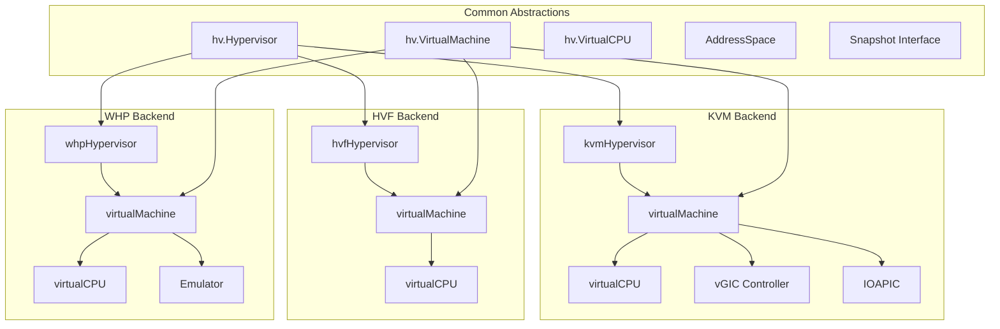
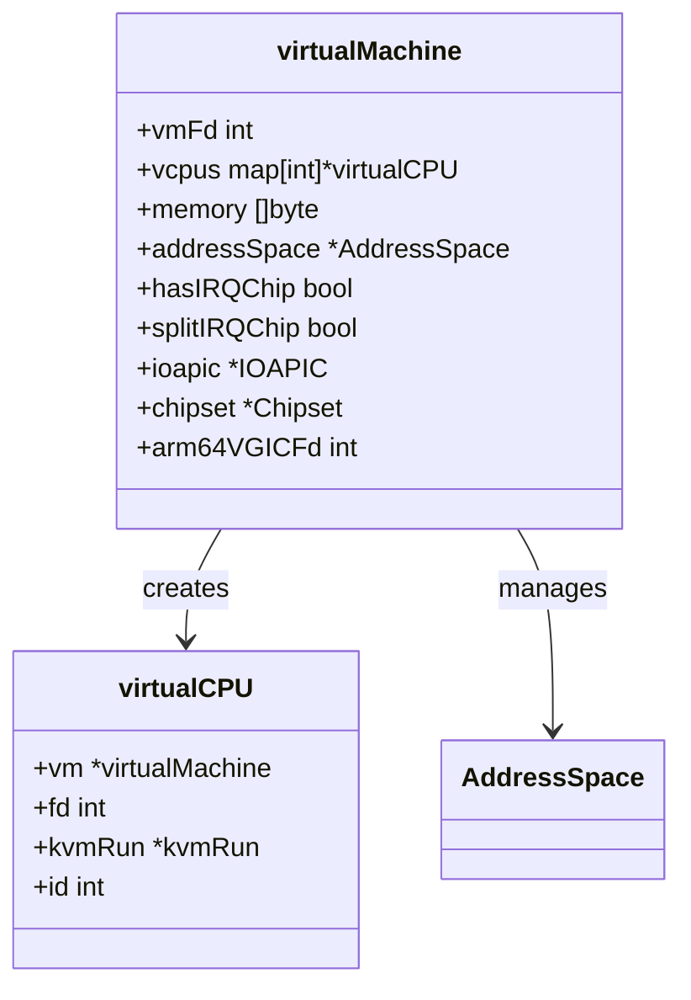
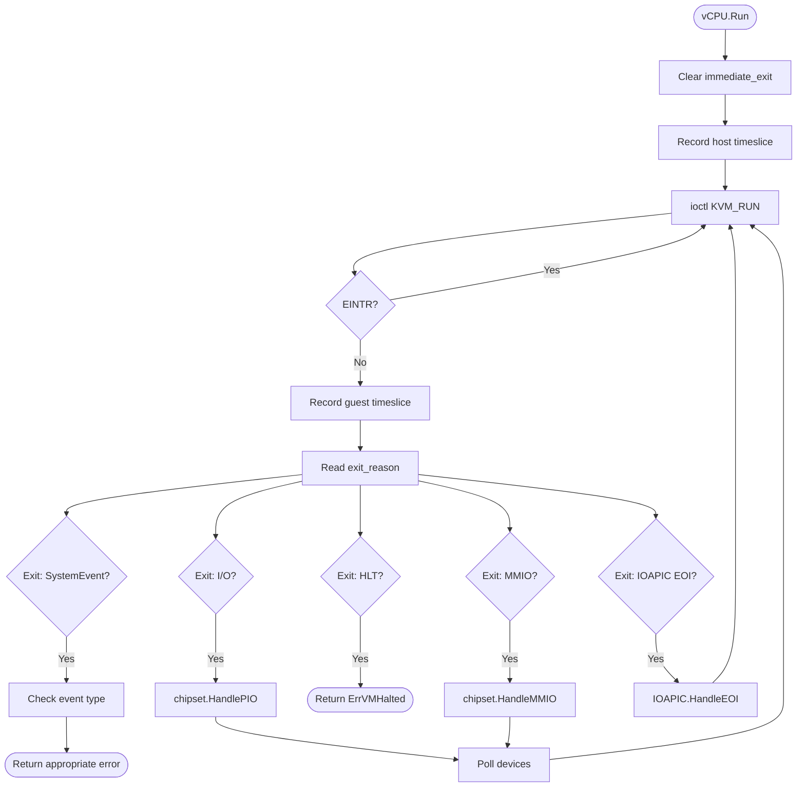
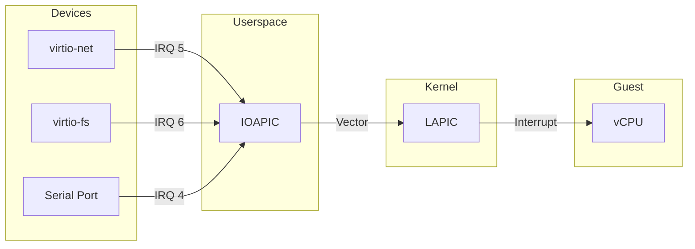
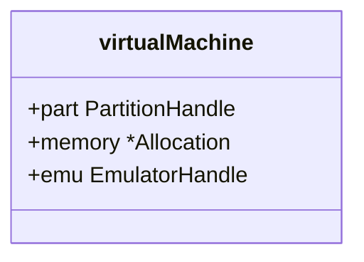
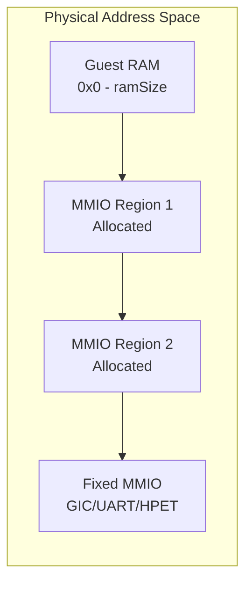
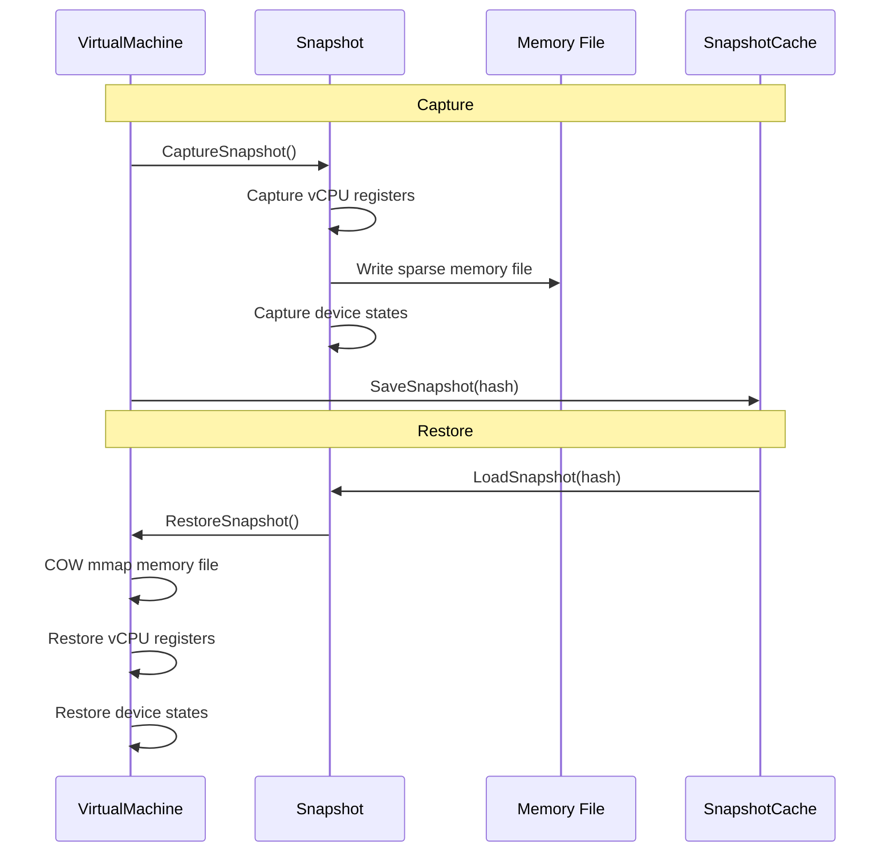

# Hypervisor Layer

The hypervisor layer provides platform-independent VM abstraction across Linux KVM, macOS Hypervisor Framework (HVF), and Windows Hypervisor Platform (WHP).

## Architecture Overview



## Core Interfaces

### Hypervisor Interface

**Location**: [`internal/hv/common.go:604-610`](../../internal/hv/common.go#L604-L610)

```go
type Hypervisor interface {
    Close() error
    Architecture() CpuArchitecture
    NewVirtualMachine(config VMConfig) (VirtualMachine, error)
}
```

### VirtualMachine Interface

**Location**: [`internal/hv/common.go:458-496`](../../internal/hv/common.go#L458-L496)

```go
type VirtualMachine interface {
    io.ReaderAt
    io.WriterAt
    io.Closer

    // Memory management
    MemorySize() uint64
    MemoryBase() uint64
    AllocateMemory(physAddr, size uint64) ([]byte, error)
    AllocateMMIO(req MMIOAllocationRequest) (MMIOAllocation, error)
    RegisterFixedMMIO(name string, base, size uint64) error

    // Execution
    Run(ctx context.Context, cfg RunConfig) error
    VirtualCPUCall(id int, f func(VirtualCPU) error) error

    // Interrupts
    SetIRQ(irqLine uint32, level uint32) error

    // Devices
    AddDevice(dev Device) error

    // Snapshots
    CaptureSnapshot() (Snapshot, error)
    RestoreSnapshot(snap Snapshot) error
}
```

### VirtualCPU Interface

**Location**: [`internal/hv/common.go:301-309`](../../internal/hv/common.go#L301-L309)

```go
type VirtualCPU interface {
    ID() int
    VirtualMachine() VirtualMachine
    SetRegisters(regs map[Register]RegisterValue) error
    GetRegisters(regs map[Register]RegisterValue) error
    Run(ctx context.Context) error
}
```

## Platform Implementations

### KVM (Linux)

**Location**: [`internal/hv/kvm/`](../../internal/hv/kvm/)

KVM uses the `/dev/kvm` interface for hardware-assisted virtualization on Linux.

#### Architecture Support

| Architecture | vCPU Support | IRQ Controller | Status |
|--------------|--------------|----------------|--------|
| x86_64 | Full | Split IRQ Chip (kernel LAPIC + userspace IOAPIC) | Production |
| ARM64 | Full | Kernel vGIC | Production |
| RISC-V | Emulated | Software | Experimental |

#### VM Structure



**Key Files**:
- [`kvm.go`](../../internal/hv/kvm/kvm.go) - Core VM/vCPU implementation
- [`kvm_amd64.go`](../../internal/hv/kvm/kvm_amd64.go) - x86_64-specific code
- [`kvm_arm64.go`](../../internal/hv/kvm/kvm_arm64.go) - ARM64-specific code
- [`kvm_arm64_vgic.go`](../../internal/hv/kvm/kvm_arm64_vgic.go) - ARM GIC controller

#### Execution Loop (x86_64)

**Location**: [`internal/hv/kvm/kvm_amd64.go:229-328`](../../internal/hv/kvm/kvm_amd64.go#L229-L328)



#### Interrupt Architecture (x86_64)

CrumbleCracker uses "split IRQ chip" mode on x86:
- **Kernel**: Local APIC (LAPIC) for IPIs and local interrupts
- **Userspace**: IOAPIC and legacy PIC for device interrupts

**Rationale**: Userspace IOAPIC provides full control over interrupt routing without kernel complexity.



#### Memory Management

**Location**: [`internal/hv/kvm/kvm.go:149-191`](../../internal/hv/kvm/kvm.go#L149-L191)

- Guest RAM: Single anonymous mmap with `KVM_SET_USER_MEMORY_REGION`
- MMIO regions: Allocated above RAM via `AddressSpace`
- KSM (Kernel Samepage Merging): Enabled on x86 with `madvise(MADV_MERGEABLE)`

### HVF (macOS)

**Location**: [`internal/hv/hvf/`](../../internal/hv/hvf/)

Apple's Hypervisor Framework for ARM64 Apple Silicon.

#### Key Characteristics

- **Single VM Constraint**: Framework allows only one guest per process
- **Global VM**: Uses `atomic.Pointer[virtualMachine]` for global access
- **Exit Model**: Framework calls host callbacks on exits

**Key File**: [`hvf_darwin_arm64.go`](../../internal/hv/hvf/hvf_darwin_arm64.go)

#### Register Mapping

HVF uses a two-level register mapping:
1. **Standard registers**: Direct `bindings.Reg` (X0-X30, PC, CPSR)
2. **System registers**: `bindings.SysReg` (VBAR_EL1, TCR_EL1, etc.)

```go
// Location: internal/hv/hvf/hvf_darwin_arm64.go:170-209
func registerToHVFRegister(reg hv.Register) bindings.Reg {
    switch reg {
    case hv.X0:  return bindings.RegX0
    case hv.X1:  return bindings.RegX1
    // ... X0-X30, PC, CPSR
    }
}
```

#### Timeslice Recording

**Location**: [`internal/hv/hvf/hvf_darwin_arm64.go:21-78`](../../internal/hv/hvf/hvf_darwin_arm64.go#L21-L78)

MMIO address `0xf0001000` is reserved for guest performance instrumentation. Guest code writes a timeslice ID (0-255) to record execution phases.

### WHP (Windows)

**Location**: [`internal/hv/whp/`](../../internal/hv/whp/)

Windows Hypervisor Platform for Windows 10/11.

#### Key Characteristics

- **Partition-based**: Uses `PartitionHandle` instead of file descriptors
- **Memory Model**: WHP allocates/manages memory directly
- **Exit Emulation**: Uses `EmulatorHandle` for I/O emulation callbacks



**Key Files**:
- [`whp.go`](../../internal/hv/whp/whp.go) - Core implementation
- [`whp_amd64.go`](../../internal/hv/whp/whp_amd64.go) - x86_64-specific code
- [`whp_arm64.go`](../../internal/hv/whp/whp_arm64.go) - ARM64-specific code

## Address Space Management

**Location**: [`internal/hv/address_space.go`](../../internal/hv/address_space.go)

The `AddressSpace` manager handles physical address allocation:



```go
type AddressSpace struct {
    arch        CpuArchitecture
    ramBase     uint64
    ramSize     uint64
    nextMMIO    uint64              // Next available MMIO address
    allocations []MMIOAllocation    // Dynamic regions
    fixedRegions []MMIOAllocation   // Pre-determined regions
}
```

**Allocation Strategy**:
1. **RAM**: Placed at `ramBase` (architecture-dependent)
2. **Dynamic MMIO**: Allocated above RAM with power-of-2 alignment
3. **Fixed MMIO**: Explicitly registered (overlap checking with RAM)

## Snapshot Support

### Snapshot Structure (x86_64)

**Location**: [`internal/hv/kvm/kvm_amd64.go:790-1240`](../../internal/hv/kvm/kvm_amd64.go#L790-L1240)

```mermaid
classDiagram
    class snapshot {
        +cpuStates map[int]vcpuSnapshot
        +memoryPath string
        +memoryFile *os.File
        +memoryMmap []byte
        +memoryOwned bool
        +clockData *kvmClockData
        +irqChips []kvmIRQChip
        +pitState *kvmPitState2
        +deviceSnapshots map[string]interface{}
    }

    class vcpuSnapshot {
        +regs kvmRegs
        +sregs kvmSregs
        +fpu kvmFpu
        +lapic kvmLapicState
        +xsave kvmXsave
        +xcrs kvmXcrs
        +msrs []msr
    }

    snapshot --> vcpuSnapshot : contains
```

### Capture/Restore Flow



### Memory Optimization

**Sparse File**: Creates holes for zero pages to minimize disk usage:

```go
// Location: internal/hv/kvm/kvm_amd64.go:1000-1020
for pageOffset := 0; pageOffset < len(memory); pageOffset += pageSize {
    page := memory[pageOffset : pageOffset+pageSize]
    if isZeroPage(page) {
        continue  // Leave hole in sparse file
    }
    file.WriteAt(page, pageOffset)
}
```

**COW Restore**: Uses `mmap(MAP_FIXED)` to remap existing address:

```go
// Location: internal/hv/kvm/kvm_amd64.go:1150-1180
mmap(nil, length, PROT_READ|PROT_WRITE, MAP_PRIVATE|MAP_FIXED, snapFd, 0)
// Virtual address unchanged, KVM doesn't need notification
```

## Design Decisions and Tradeoffs

### Single vCPU Design

**Decision**: Enforce single vCPU per VM in factory.

**Rationale**:
- Simplifies device synchronization
- Matches embedded use case (container workloads)
- Reduces context switch overhead

**Tradeoff**: Limits guest parallelism for CPU-intensive workloads.

### OS Thread Locking

**Decision**: Lock vCPU goroutine to OS thread.

```go
// Location: internal/hv/kvm/kvm.go:34-54
runtime.LockOSThread()
defer runtime.UnlockOSThread()
```

**Rationale**: KVM requires consistent kernel thread binding for vCPU execution.

**Tradeoff**: Prevents goroutine migration, uses dedicated OS thread.

### Split IRQ Chip (x86 KVM)

**Decision**: Kernel LAPIC + userspace IOAPIC.

**Rationale**:
- Full control over interrupt routing
- Simpler device interrupt handling
- Easier debugging

**Tradeoff**: Additional exit overhead for EOI handling.

### Immediate Exit via Signal

**Decision**: Use signal injection for async vCPU exit.

```go
// Location: internal/hv/kvm/kvm_amd64.go:230-241
context.AfterFunc(ctx, func() {
    vcpu.RequestImmediateExit()  // Sets immediate_exit flag
})
```

**Rationale**: Allows context cancellation without polling.

**Tradeoff**: Requires signal safety and thread ID tracking.

## Performance Optimizations

1. **KSM (x86 KVM)**: `madvise(MADV_MERGEABLE)` for memory deduplication
2. **Lazy GIC Finalization (ARM64)**: Deferred vGIC setup post-vCPU-init
3. **Fast-Path Timeslice MMIO**: Special address checked before device lookup
4. **Late Chipset Binding**: Defers dispatch table construction to first run

## Next Steps

- [Virtio Devices](./03-virtio-devices.md) - Device implementation details
- [Chipset & IR](./07-chipset-ir.md) - Device routing internals
