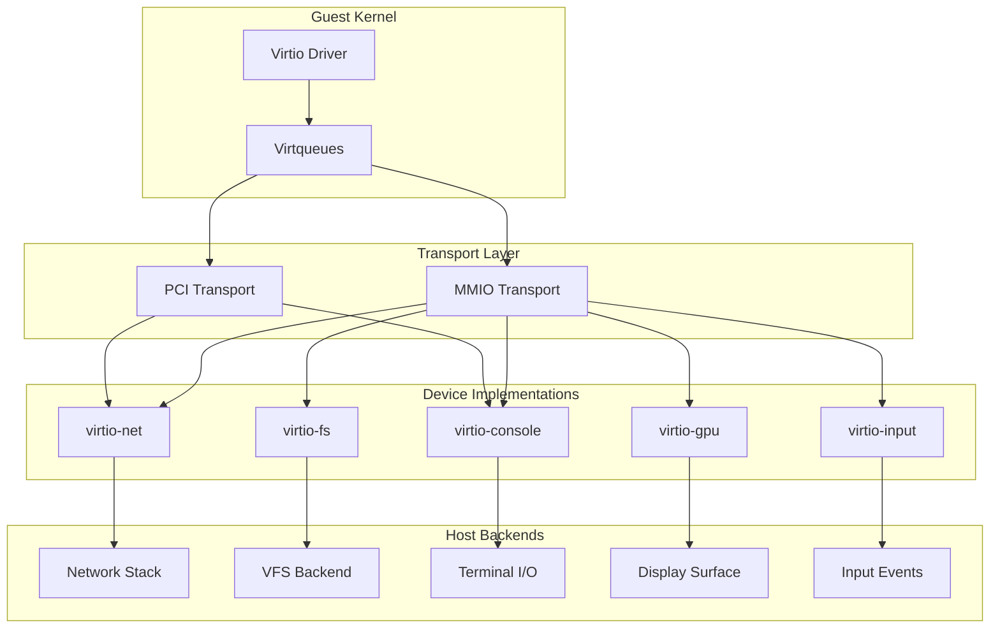
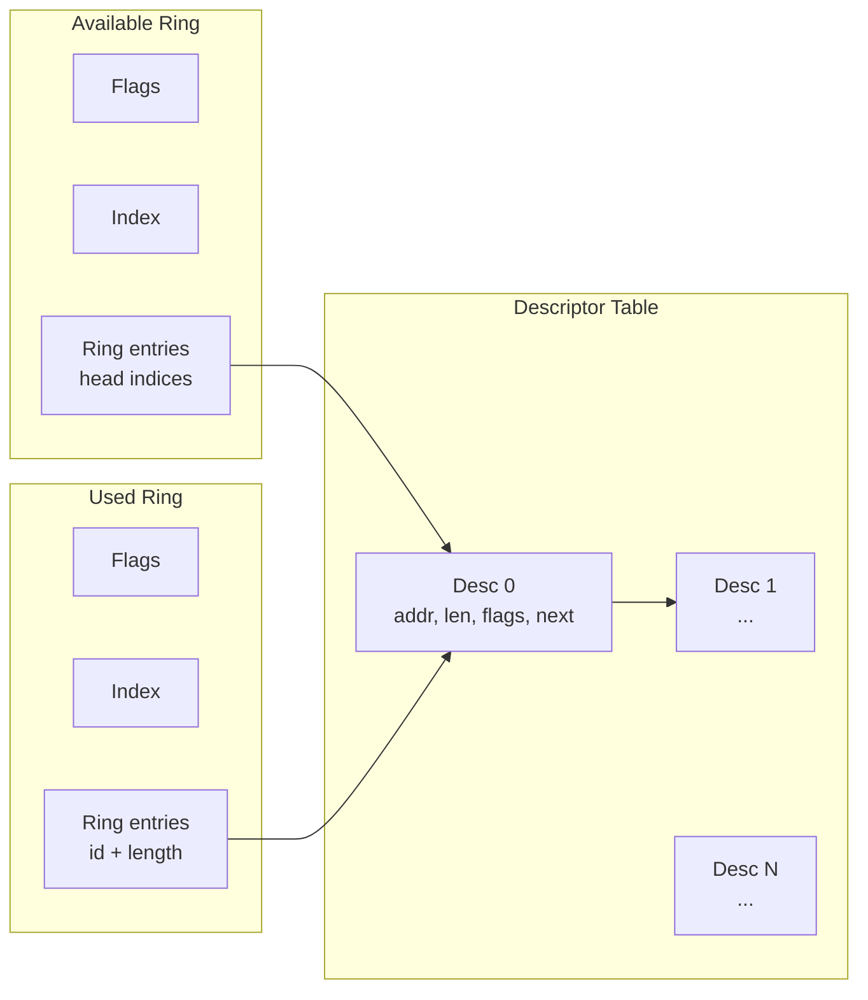
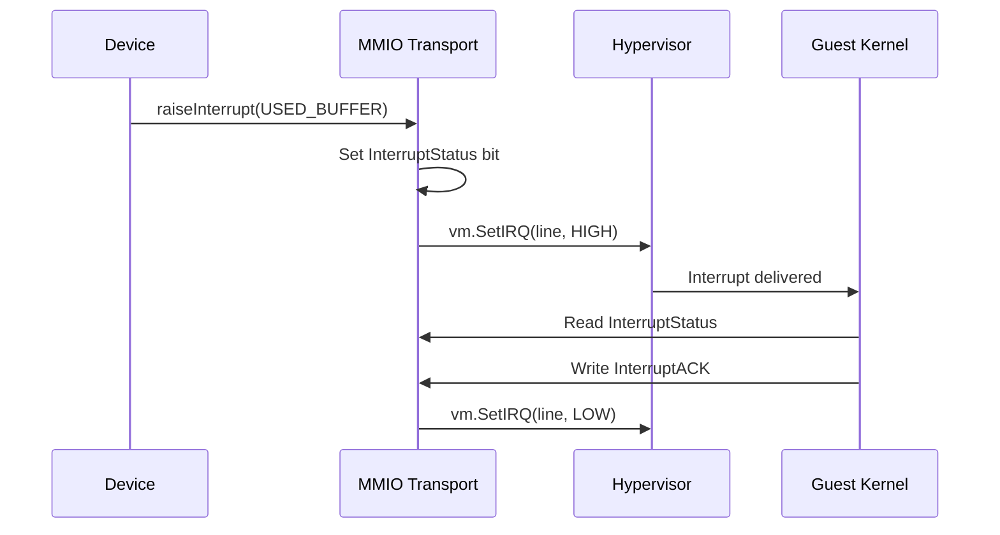
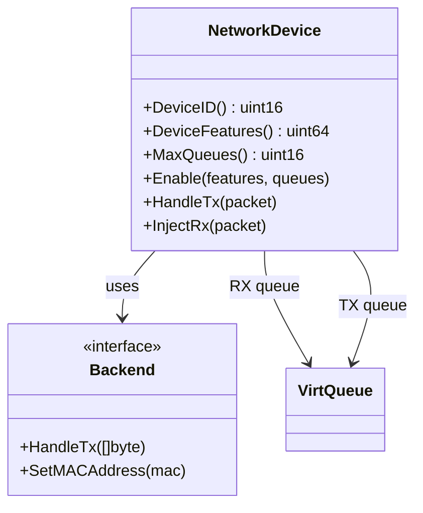
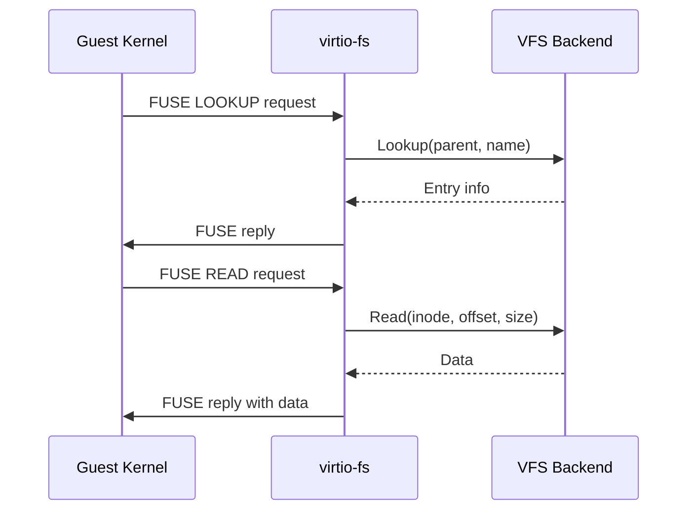
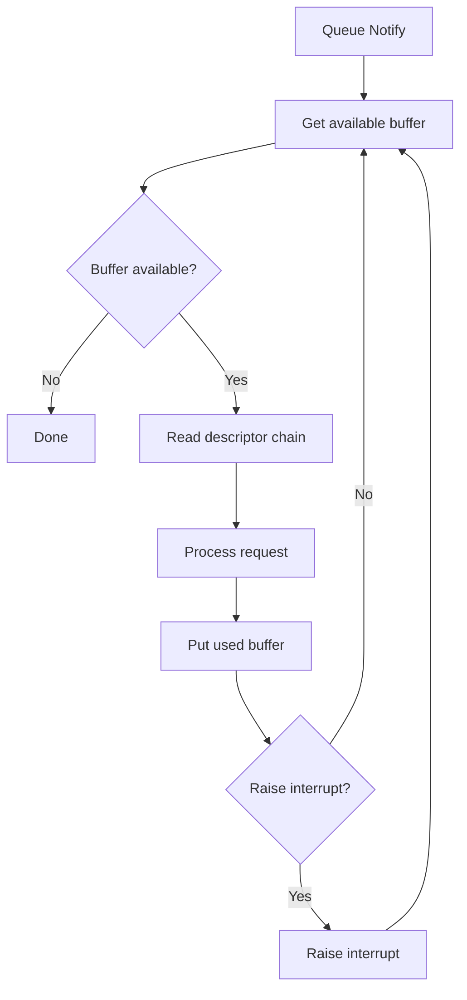

# Virtio Devices

CrumbleCracker implements virtio devices for guest-host communication following the VIRTIO 1.0+ specification with both MMIO and PCI transports.

## Architecture Overview



## Core Abstractions

### VirtioDevice Interface

**Location**: [`internal/devices/virtio/device.go:10-48`](../../internal/devices/virtio/device.go#L10-L48)

```go
type VirtioDevice interface {
    // Device identification
    DeviceID() uint16                                    // Virtio device type
    DeviceFeatures() uint64                              // Supported feature bits

    // Queue configuration
    MaxQueues() uint16                                   // Number of virtqueues

    // Configuration space access
    ReadConfig(ctx hv.ExitContext, offset uint16) uint32
    WriteConfig(ctx hv.ExitContext, offset uint16, val uint32)

    // Lifecycle
    Enable(features uint64, queues []*VirtQueue)         // After feature negotiation
    Disable()                                             // On reset
}
```

### VirtQueue Structure

**Location**: [`internal/devices/virtio/queue.go:31-50`](../../internal/devices/virtio/queue.go#L31-L50)

```go
type VirtQueue struct {
    DescTableAddr uint64    // Guest physical address of descriptor table
    AvailRingAddr uint64    // Available ring address
    UsedRingAddr  uint64    // Used ring address
    Size          uint16    // Queue size (power of 2)
    MaxSize       uint16    // Maximum queue size
    Enabled       bool
    Ready         bool
    lastAvailIdx  uint16    // Last processed available index
    usedIdx       uint16    // Current used index
    mem           GuestMemory
    NotifyEvent   chan struct{}
}
```

### Virtqueue Ring Layout



**Ring Structure**:
- **Descriptor Table** (16 bytes each): Buffer address, length, flags (NEXT, WRITE), next index
- **Available Ring**: Driver-to-device notification of ready descriptors
- **Used Ring**: Device-to-driver notification of completed descriptors

## Transport Implementations

### MMIO Transport

**Location**: [`internal/devices/virtio/mmio.go`](../../internal/devices/virtio/mmio.go)

Memory-mapped I/O transport for ARM64 and embedded systems.

#### Register Map

| Offset | Name | Access | Description |
|--------|------|--------|-------------|
| 0x000 | MagicValue | R | "virt" (0x74726976) |
| 0x004 | Version | R | VIRTIO version |
| 0x008 | DeviceID | R | Device type |
| 0x00c | VendorID | R | Vendor ID |
| 0x010 | DeviceFeatures | R | Feature bits (selected by 0x014) |
| 0x014 | DeviceFeaturesSel | W | Feature selector (0 or 1) |
| 0x020 | DriverFeatures | W | Accepted features |
| 0x024 | DriverFeaturesSel | W | Feature selector |
| 0x030 | QueueSel | W | Queue index |
| 0x034 | QueueNumMax | R | Max queue size |
| 0x038 | QueueNum | W | Current queue size |
| 0x044 | QueueReady | RW | Queue ready bit |
| 0x050 | QueueNotify | W | Queue notification |
| 0x060 | InterruptStatus | R | Pending interrupts |
| 0x064 | InterruptACK | W | Interrupt acknowledgment |
| 0x070 | Status | RW | Device status |
| 0x080-0x09c | QueueDesc/Avail/Used | W | Queue addresses |
| 0x0fc | ConfigGeneration | R | Config change counter |
| 0x100+ | Config | RW | Device-specific config |

#### Interrupt Flow



### PCI Transport

**Location**: [`internal/devices/virtio/pci.go`](../../internal/devices/virtio/pci.go)

PCI transport for x86_64 systems with MSI-X support.

#### Capability Structure

| Capability | BAR | Description |
|------------|-----|-------------|
| COMMON_CFG | 0 | Device configuration |
| NOTIFY_CFG | 2 | Queue notifications |
| ISR_CFG | 1 | Interrupt status |
| DEVICE_CFG | 4 | Device-specific config |

#### MSI-X Implementation

**Location**: [`internal/devices/virtio/pci.go:1818-1856`](../../internal/devices/virtio/pci.go#L1818-L1856)

```go
type msixTableEntry struct {
    addrLow    uint32  // Message address low
    addrHigh   uint32  // Message address high
    data       uint32  // Message data
    vectorCtrl uint32  // Vector control (mask bit)
}
```

**Features**:
- Per-queue interrupt vectors
- Configuration change vector
- Deferred delivery when masked
- Pending bit array for masked interrupts

## Device Implementations

### Network Device (virtio-net)

**Location**: [`internal/devices/virtio/net.go`](../../internal/devices/virtio/net.go)



**Queue Layout**:
- Queue 0: RX (device → driver)
- Queue 1: TX (driver → device)

**Virtio Network Header** (12 bytes):

| Offset | Field | Description |
|--------|-------|-------------|
| 0 | flags | NEEDS_CSUM, DATA_VALID |
| 1 | gsoType | GSO type (none, tcpv4, udp, tcpv6) |
| 2-3 | hdrLen | Header length for GSO |
| 4-5 | gsoSize | GSO segment size |
| 6-7 | csumStart | Checksum start offset |
| 8-9 | csumOffset | Checksum offset |
| 10-11 | numBuffers | Number of buffers (merged rx) |

**Features**:
- MAC address negotiation (bit 5)
- Merged RX buffers (bit 15)
- Status reporting (bit 16)
- Event index (bit 29)

### Filesystem Device (virtio-fs)

**Location**: [`internal/devices/virtio/fs.go`](../../internal/devices/virtio/fs.go)

Implements FUSE protocol over virtio for host filesystem access.



**Queue Layout**:
- Queue 0: High-priority (not used)
- Queue 1: Request queue

**FUSE Header Format**:

```go
// Request header (40 bytes)
type fuseInHeader struct {
    Len        uint32  // Total request length
    Opcode     uint32  // FUSE operation
    Unique     uint64  // Request ID
    Nodeid     uint64  // Inode being operated on
    Uid        uint32  // User ID
    Gid        uint32  // Group ID
    Pid        uint32  // Process ID
    TotalExtLen uint16 // Extension length
    Padding    uint16
}

// Response header (16 bytes)
type fuseOutHeader struct {
    Len    uint32  // Response length
    Error  int32   // 0 or -errno
    Unique uint64  // Echo of request ID
}
```

### Console Device (virtio-console)

**Location**: [`internal/devices/virtio/console.go`](../../internal/devices/virtio/console.go)

Simple duplex character device for guest terminal.

**Queue Layout**:
- Queue 0: RX (host → guest)
- Queue 1: TX (guest → host)

**Configuration**:

```go
type consoleConfig struct {
    Cols      uint16  // Terminal columns
    Rows      uint16  // Terminal rows
    MaxNrPorts uint32 // Number of ports
    EmergWrite uint32 // Emergency write port
}
```

**I/O Flow**:
- TX: Consumes descriptor chains, writes to host output
- RX: Fills descriptors from pending input buffer
- Special handling: Proactively processes TX when handling RX

### GPU Device (virtio-gpu)

**Location**: [`internal/devices/virtio/gpu.go`](../../internal/devices/virtio/gpu.go)

2D graphics device for framebuffer display.

**Queue Layout**:
- Queue 0: Control queue
- Queue 1: Cursor queue

**Resource Management**:

```go
type GPU struct {
    resources map[uint32]*resource2D  // 2D resource objects
    scanouts  [16]scanoutConfig       // Display outputs
    OnFlush   func()                  // Frame delivery callback
}
```

**Control Commands**:
- `GET_DISPLAY_INFO`: Query display dimensions
- `RESOURCE_CREATE_2D`: Create framebuffer resource
- `RESOURCE_ATTACH_BACKING`: Attach guest memory
- `SET_SCANOUT`: Configure display output
- `RESOURCE_FLUSH`: Trigger display update
- `TRANSFER_TO_HOST_2D`: Copy from guest to resource

### Input Device (virtio-input)

**Location**: [`internal/devices/virtio/input.go`](../../internal/devices/virtio/input.go)

Keyboard and tablet/mouse input.

**Device Types**:
- Keyboard: Key press/release events
- Tablet: Absolute position (touch/stylus)

**Queue Layout**:
- Queue 0: Event queue (device → driver)
- Queue 1: Status queue (driver → device)

**Event Format**:

```go
type inputEvent struct {
    Type  uint16  // EV_KEY, EV_ABS, etc.
    Code  uint16  // Key code or axis
    Value uint32  // Key state or position
}
```

**Configuration Selectors**:
- `VIRTIO_INPUT_CFG_ID_NAME`: Device name
- `VIRTIO_INPUT_CFG_PROP_BITS`: Property bitmap
- `VIRTIO_INPUT_CFG_EV_BITS`: Supported event types
- `VIRTIO_INPUT_CFG_ABS_INFO`: Axis range info

## Queue Processing

### Notification Flow



### Helper Functions

**Location**: [`internal/devices/virtio/queue_helpers.go`](../../internal/devices/virtio/queue_helpers.go)

```go
// Process all available buffers
func ProcessQueueNotifications(q *VirtQueue, processor func(chain)) (bool, error)

// Check if interrupt should be raised
func ShouldRaiseInterrupt(q *VirtQueue) bool

// Read descriptor chain for TX (device reads from guest)
func ReadDescriptorChain(q *VirtQueue, head uint16) ([]byte, error)

// Fill descriptor chain for RX (device writes to guest)
func FillDescriptorChain(q *VirtQueue, head uint16, data []byte) error
```

## Device Template System

**Location**: [`internal/devices/virtio/device_base.go`](../../internal/devices/virtio/device_base.go)

Templates provide architecture-aware device instantiation:

```go
type MMIODeviceTemplateBase struct {
    name       string
    irqLine    uint32
    timeslices []timeslice.TimesliceKind
}

func (t *MMIODeviceTemplateBase) GetDeviceTreeInfo() []fdt.NodeTemplate
func (t *MMIODeviceTemplateBase) GetACPIDeviceInfo() acpi.DeviceInfo
```

**Features**:
- Architecture-specific IRQ line selection (x86/ARM64)
- Device tree node generation for Linux
- ACPI DSDT entry generation

## Design Decisions and Tradeoffs

### Worker Thread Pattern (virtio-net)

**Decision**: Async processing with dedicated goroutine.

**Location**: [`internal/devices/virtio/net.go:191-202`](../../internal/devices/virtio/net.go#L191-L202)

**Rationale**:
- Prevents exit context blocking during I/O
- Backpressure-aware RX packet queuing
- Host-side processing without VM stalls

**Tradeoff**: Adds latency vs lower VM overhead.

### Event Index Support

**Decision**: Optional event index negotiation.

**Location**: [`internal/devices/virtio/mmio.go:127`](../../internal/devices/virtio/mmio.go#L127)

**Rationale**:
- Reduces interrupt overhead for high-throughput workloads
- Driver-side coalescing without kernel involvement

**Tradeoff**: Additional complexity for interrupt suppression logic.

### Two-Interface Design

**Decision**: Support both new `VirtioDevice` and legacy `deviceHandler`.

**Location**: [`internal/devices/virtio/mmio.go:156-198`](../../internal/devices/virtio/mmio.go#L156-L198)

**Rationale**:
- Backward compatibility during migration
- VirtioDevice takes precedence when available

### Backpressure Limiting (virtio-net)

**Decision**: Hard cap on pending RX packets (256).

**Location**: [`internal/devices/virtio/net.go:52-55`](../../internal/devices/virtio/net.go#L52-L55)

**Rationale**: Prevents unbounded memory growth when guest doesn't replenish buffers.

**Tradeoff**: Guest must process packets regularly to avoid drops.

## Performance Considerations

### Memory Access Pooling

**Location**: [`internal/devices/virtio/net.go:101-103`](../../internal/devices/virtio/net.go#L101-L103)

Object pools for TX buffers and headers reduce allocation overhead.

### Atomic Interrupt Status

**Location**: [`internal/devices/virtio/mmio.go:224`](../../internal/devices/virtio/mmio.go#L224)

Lock-free updates via `atomic.Uint32` for high-frequency interrupt handling.

### BAR Layout Strategy (PCI)

**Location**: [`internal/devices/virtio/pci.go:294-310`](../../internal/devices/virtio/pci.go#L294-L310)

Fixed BAR allocation pattern optimizes for kernel driver expectations:
- BAR0: Common config
- BAR1: ISR
- BAR2: Notify region
- BAR4: Device config

## Next Steps

- [Network Stack](./04-network-stack.md) - TCP/IP implementation details
- [Filesystem & OCI](./05-filesystem-oci.md) - VFS backend architecture
