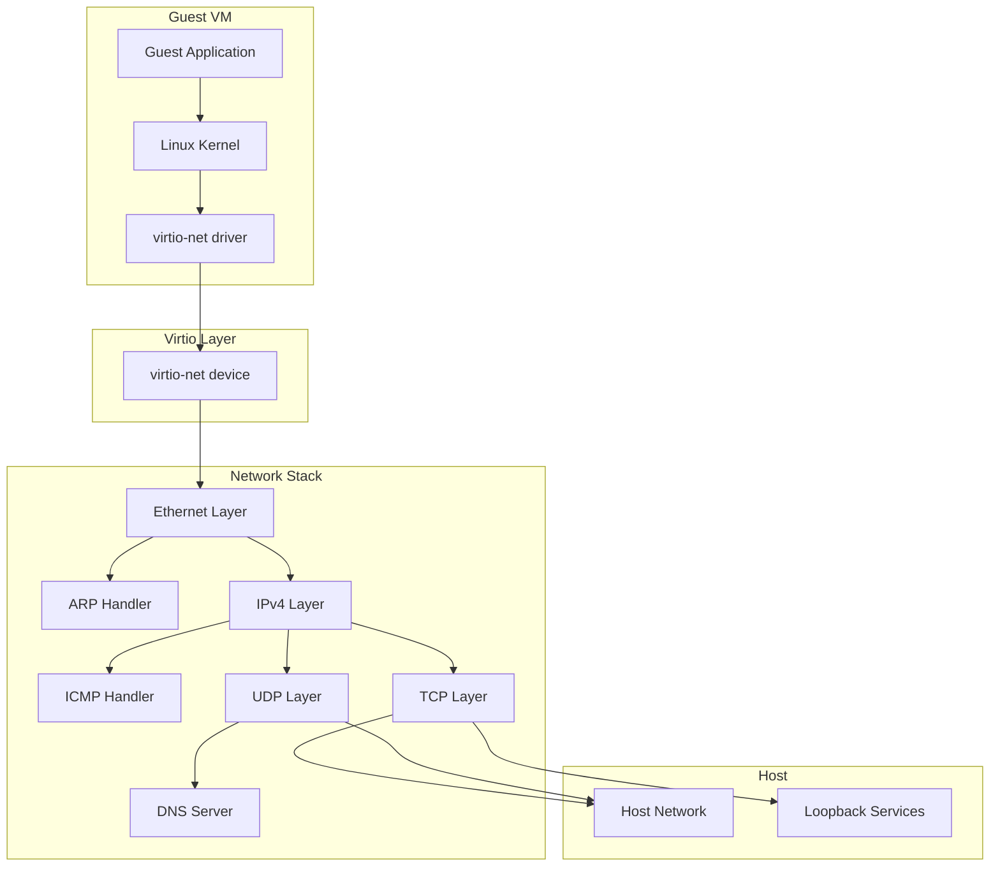
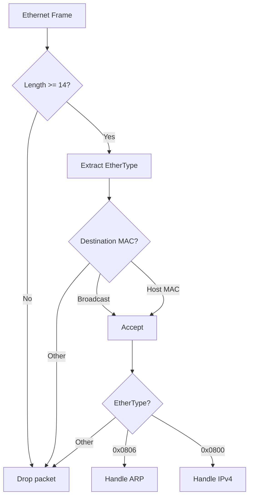
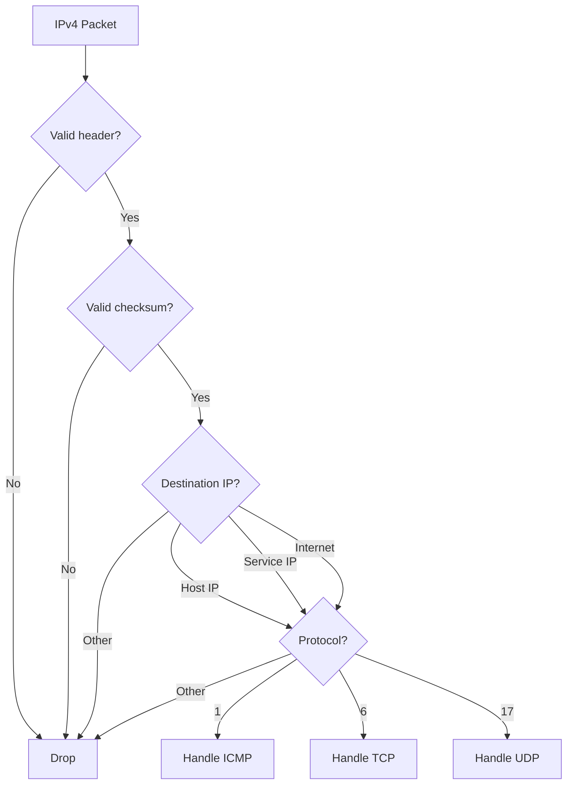
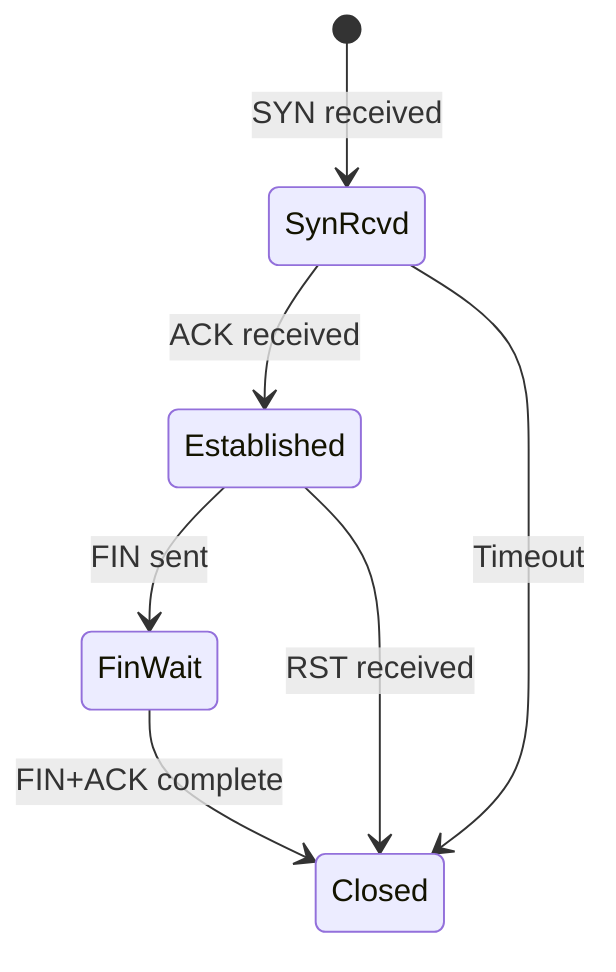
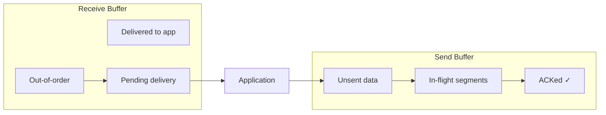
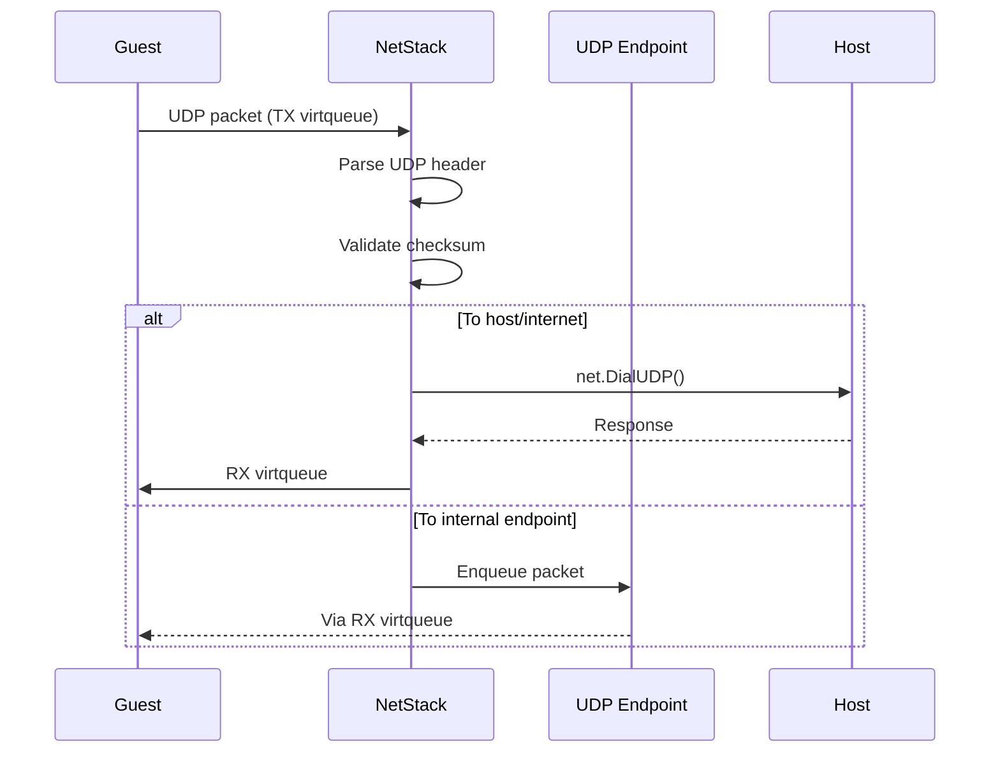
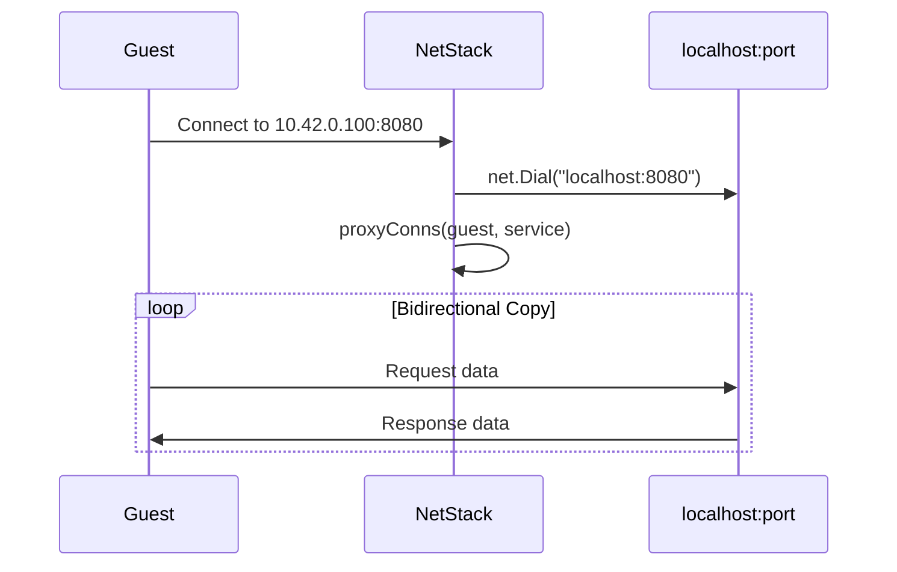

# Network Stack

CrumbleCracker implements a custom userspace TCP/IP stack instead of using system TAP devices, providing cross-platform networking without kernel dependencies.

## Design Philosophy

The network stack is intentionally minimal:
- IPv4 only (no IPv6)
- No IP fragmentation/reassembly
- Simplified TCP (no advanced congestion control edge cases)
- Single-source MAC learning

**Rationale**: Reduce complexity while providing sufficient functionality for container workloads.

## Architecture Overview



## Core Components

### NetStack Structure

**Location**: [`internal/netstack/netstack.go:289-307`](../../internal/netstack/netstack.go#L289-L307)

```go
type NetStack struct {
    // Configuration
    hostIP      [4]byte     // Default: 10.42.0.1
    guestIP     [4]byte     // Default: 10.42.0.2
    serviceIP   [4]byte     // Default: 10.42.0.100

    // State
    hostMAC     atomic.Uint64
    guestMAC    atomic.Uint64

    // Connection tracking
    mu          sync.RWMutex
    tcpListen   map[uint16]*tcpListener    // Port → listener
    tcpConns    map[tcpFourTuple]*tcpConn  // 4-tuple → connection
    udpSockets  sync.Map                    // Port → endpoint
}
```

### Network Interface

**Location**: [`internal/netstack/netstack.go:497-584`](../../internal/netstack/netstack.go#L497-L584)

```go
type NetworkInterface struct {
    stack   *NetStack
    backend func(frame []byte) error  // TX callback to virtio-net
}

// Attach virtio-net backend
func (ns *NetStack) AttachVirtioBackend(backend func([]byte) error) *NetworkInterface

// Receive packet from guest
func (iface *NetworkInterface) DeliverGuestPacket(frame []byte) error
```

## Protocol Layers

### Ethernet Layer

**Location**: [`internal/netstack/netstack.go:616-650`](../../internal/netstack/netstack.go#L616-L650)

Handles Layer 2 filtering and protocol demultiplexing:



### ARP Handler

**Location**: [`internal/netstack/netstack.go:773-840`](../../internal/netstack/netstack.go#L773-L840)

Responds to ARP requests for host and service IPs:

```go
// ARP reply generation
func (ns *NetStack) handleArpRequest(srcMAC, srcIP, targetIP) {
    if targetIP == ns.hostIP || targetIP == ns.serviceIP {
        // Reply with host MAC
        sendArpReply(ns.hostMAC, targetIP, srcMAC, srcIP)
    }
}
```

### IPv4 Layer

**Location**: [`internal/netstack/netstack.go:870-991`](../../internal/netstack/netstack.go#L870-L991)

Validates IPv4 headers and dispatches to upper layers:



## TCP Implementation

### Connection State Machine

**Location**: [`internal/netstack/netstack.go:1435-1442`](../../internal/netstack/netstack.go#L1435-L1442)



### Connection Structure

**Location**: [`internal/netstack/netstack.go:1511-1570`](../../internal/netstack/netstack.go#L1511-L1570)

```go
type tcpConn struct {
    // Identity
    localIP, remoteIP   [4]byte
    localPort, remotePort uint16

    // Sequence tracking
    sendNext  uint32    // Next sequence to send
    sendUnack uint32    // Oldest unacknowledged
    recvNext  uint32    // Next expected from peer

    // Flow control
    peerWnd      uint16       // Peer's receive window
    peerWndScale uint8        // Window scale shift
    ourWndScale  uint8

    // Congestion control
    congCtrl *tcpCongestionControl

    // Buffers
    sendBuf *tcpSendBuffer
    recvBuf chan []byte      // 512 capacity
    oooRecvBuf *tcpRecvBuffer
}
```

### TCP Options

**Location**: [`internal/netstack/tcp.go:27-104`](../../internal/netstack/tcp.go#L27-L104)

Parsed from SYN/SYN-ACK:
- **MSS** (Maximum Segment Size): Determines max payload per segment
- **Window Scale**: Extends 16-bit window to handle high bandwidth

```go
func parseTCPOptions(options []byte) (mss uint16, wsOK bool, ws uint8)
func buildSynAckOptions(mss uint16, ws uint8) []byte
```

### Congestion Control

**Location**: [`internal/netstack/tcp.go:401-450`](../../internal/netstack/tcp.go#L401-L450)

RFC 5681 TCP Reno implementation:

```go
type tcpCongestionControl struct {
    cwnd     uint32    // Congestion window (bytes)
    ssthresh uint32    // Slow-start threshold
    mss      uint16    // Max segment size
    dupAcks  int       // Duplicate ACK counter
}
```

**Phases**:
1. **Slow Start**: `cwnd` doubles per RTT until `ssthresh`
2. **Congestion Avoidance**: Linear growth after `ssthresh`
3. **Fast Retransmit**: On 3 duplicate ACKs

### RTT Estimation

**Location**: [`internal/netstack/tcp.go:322-396`](../../internal/netstack/tcp.go#L322-L396)

RFC 6298 implementation:

```go
// Smoothed RTT: SRTT = 7/8 * SRTT + 1/8 * R'
// RTT variance: RTTVAR = 3/4 * RTTVAR + 1/4 * |SRTT - R'|
// RTO = SRTT + 4 * RTTVAR, bounded [200ms, 60s]
```

### Send/Receive Buffers

**Location**: [`internal/netstack/tcp.go:119-316`](../../internal/netstack/tcp.go#L119-L316)



## UDP Implementation

**Location**: [`internal/netstack/netstack.go:1097-1350`](../../internal/netstack/netstack.go#L1097-L1350)

### UDP Endpoint

```go
type udpEndpointConn struct {
    stack    *NetStack
    port     uint16
    incoming chan udpPacket  // 32 capacity
}

func (e *udpEndpointConn) ReadFrom(buf []byte) (int, net.Addr, error)
func (e *udpEndpointConn) WriteTo(buf []byte, addr net.Addr) (int, error)
```

### UDP Processing Flow



## DNS Server

**Location**: [`internal/netstack/dns.go`](../../internal/netstack/dns.go)

Built-in DNS server for internal name resolution.

```go
type dnsServer struct {
    log    *slog.Logger
    server *dns.Server           // miekg/dns
    lookup func(string) (string, error)
}
```

### Internal Names

| Name | Resolution |
|------|------------|
| `host.internal` | 10.42.0.1 (stack IP) |
| `guest.internal` | 10.42.0.2 (guest IP) |
| `service.internal` | 10.42.0.100 (service IP) |

### Fallback Resolution

When `allowInternet=true`, unknown names fall back to `net.ResolveIPAddr()`:

```go
// Location: internal/netstack/netstack.go:2813-2831
func resolveDNS(name string) (string, error) {
    switch name {
    case "host.internal":
        return "10.42.0.1", nil
    case "guest.internal":
        return "10.42.0.2", nil
    case "service.internal":
        return "10.42.0.100", nil
    default:
        return net.ResolveIPAddr("ip4", name)
    }
}
```

## Memory Management

### Buffer Pools

**Location**: [`internal/netstack/netstack.go:123-225`](../../internal/netstack/netstack.go#L123-L225)

Three pools reduce GC pressure:

| Pool | Default Size | Max Size | Purpose |
|------|--------------|----------|---------|
| TCP Packet | 64KB + 20B | 256KB + 20B | TCP segment buffers |
| IPv4 Packet | 64KB + 20B | 256KB + 20B | IPv4 packet buffers |
| Ethernet Frame | 64KB + 14B | 256KB + 14B | Full frame buffers |

```go
var tcpPacketPool = sync.Pool{
    New: func() any {
        return make([]byte, 64*1024+20)
    },
}

func getTCPPacketBuffer() []byte {
    buf := tcpPacketPool.Get().([]byte)
    return buf[:cap(buf)]
}
```

### Concurrency Safety

**Critical Note**: Never hold `ns.mu` while calling backend.

**Location**: [`internal/netstack/netstack.go:586-596`](../../internal/netstack/netstack.go#L586-L596)

```go
// WRONG: Deadlock risk
ns.mu.RLock()
backend(frame)  // May re-enter via DeliverGuestPacket → write lock
ns.mu.RUnlock()

// CORRECT: Copy data, release lock, then send
ns.mu.RLock()
frameCopy := append([]byte{}, frame...)
ns.mu.RUnlock()
backend(frameCopy)
```

## Proxy Modes

### Service Proxy

**Location**: [`internal/netstack/netstack.go:2599-2625`](../../internal/netstack/netstack.go#L2599-L2625)

Bridges guest connections to localhost services:



### Transparent Proxy

**Location**: [`internal/netstack/netstack.go:2627-2655`](../../internal/netstack/netstack.go#L2627-L2655)

Routes guest internet traffic through host:

```go
func (ns *NetStack) handleOutboundTCP(guestConn, destIP, destPort) {
    hostConn, err := net.Dial("tcp", fmt.Sprintf("%s:%d", destIP, destPort))
    if err != nil {
        sendRST(guestConn)
        return
    }
    go proxyConns(guestConn, hostConn)
}
```

## Design Decisions and Tradeoffs

### Custom Stack vs TAP Devices

| Aspect | Custom Stack | TAP Devices |
|--------|--------------|-------------|
| Dependencies | None | Kernel modules, root |
| Portability | Any OS | Linux primarily |
| Setup | Instant | iptables, routing |
| Performance | ~10μs latency | ~5μs latency |
| Features | IPv4 only | Full IP stack |

**Decision**: Custom stack for simplicity and portability.

### Single MAC Learning

**Decision**: Record only latest observed source MAC.

**Rationale**: Guest typically has single network interface; simplifies ARP table.

**Tradeoff**: Multiple guest NICs not supported.

### No IP Fragmentation

**Decision**: Drop fragmented packets.

**Rationale**: MTU 1500 sufficient for most workloads; fragmentation adds complexity.

**Tradeoff**: Large packets fail silently.

### Simplified TCP

**Decision**: No SACK, limited congestion control.

**Rationale**: Container workloads typically use HTTP/HTTPS with modern servers.

**Tradeoff**: May underperform on lossy networks.

## Performance Optimizations

### Checksum Computation

**Location**: [`internal/netstack/netstack.go:3031-3084`](../../internal/netstack/netstack.go#L3031-L3084)

Two-stage checksum:
1. IPv4 pseudo-header: src+dst IPs, protocol, length
2. Segment checksum with pseudo-header sum

### Packet Encoding

**Location**: [`internal/netstack/netstack.go:908-975`](../../internal/netstack/netstack.go#L908-L975)

Pre-allocated buffer functions avoid heap allocation:

```go
func buildIPv4PacketInto(buf []byte, ...) []byte
func buildEthernetHeaderInto(buf []byte, ...) []byte
```

### MAC Address Operations

**Location**: [`internal/netstack/netstack.go:661-703`](../../internal/netstack/netstack.go#L661-L703)

MAC addresses stored as `uint64` for compact atomic operations.

## Debugging

### Packet Capture

Set `CC_NETSTACK_PCAP_DIR` to capture host-side traffic:

```bash
CC_NETSTACK_PCAP_DIR=local/pcap ./tools/build.go -bringup
```

### Debug Logging

High-volume binary debug logs via `CC_DEBUG_FILE`:

```bash
CC_DEBUG_FILE=local/net-debug.bin ./tools/build.go -bringup
./tools/build.go -dbg-tool -- -source 'net' local/net-debug.bin
```

## Next Steps

- [Filesystem & OCI](./05-filesystem-oci.md) - Storage layer architecture
- [Boot & Init System](./06-boot-init.md) - Guest initialization
