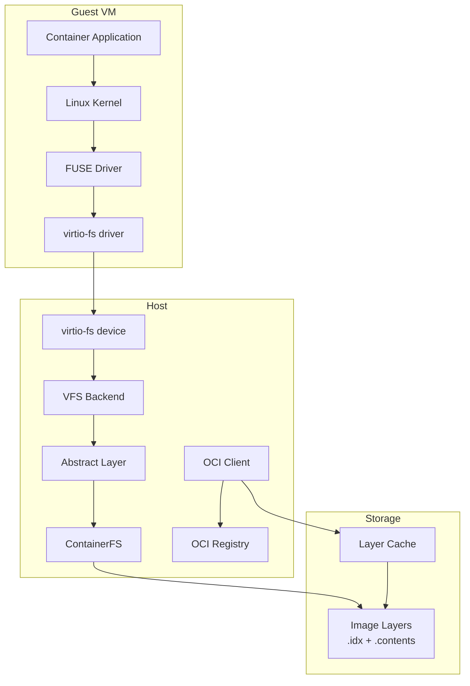
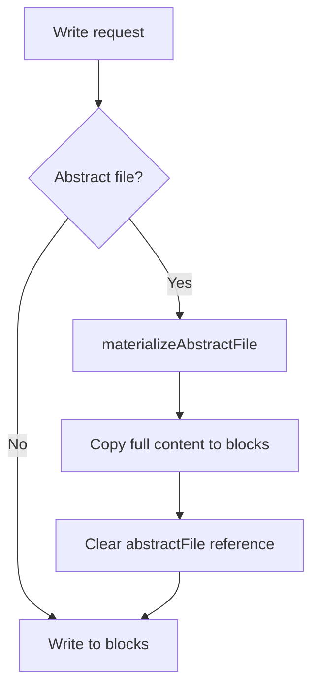
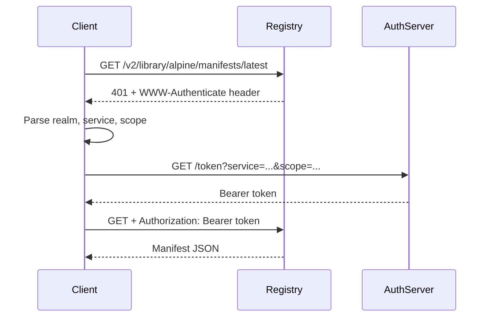
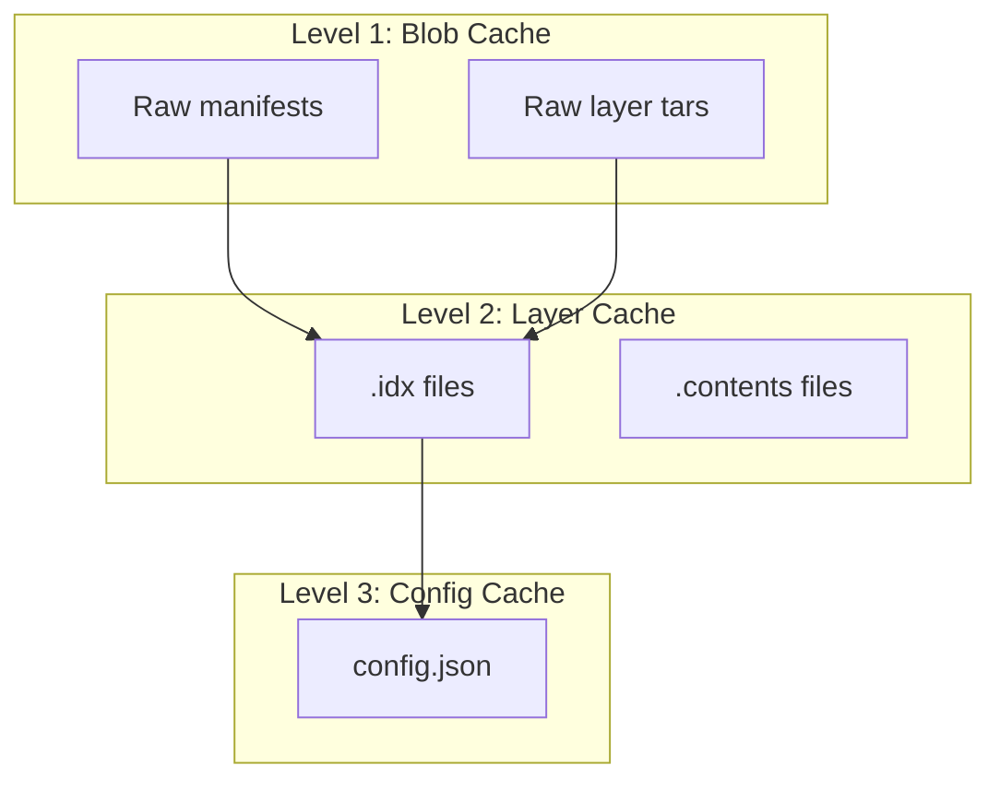
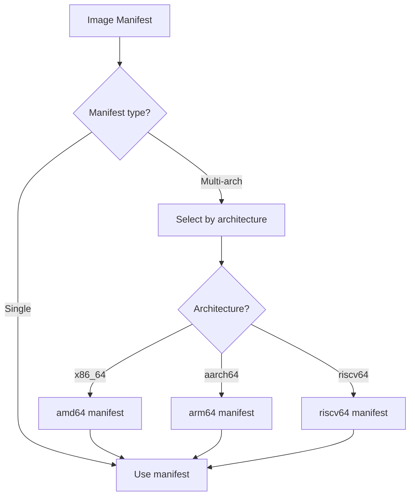
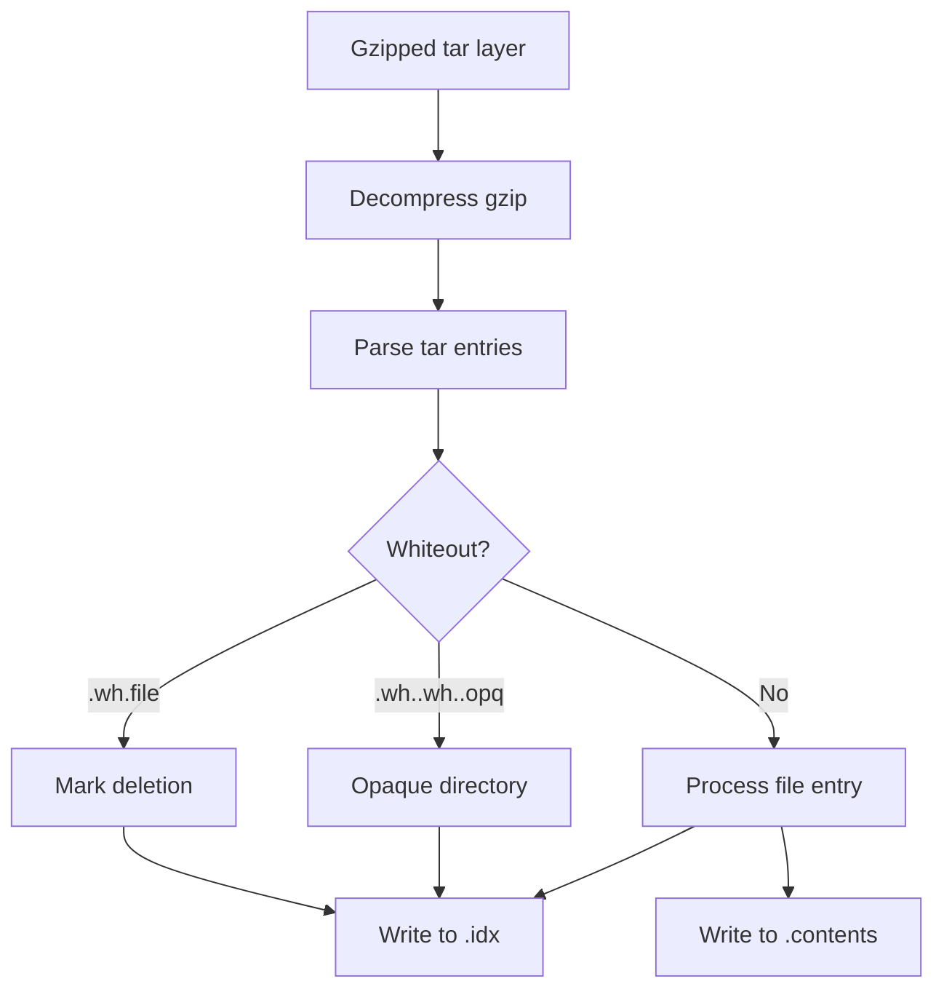
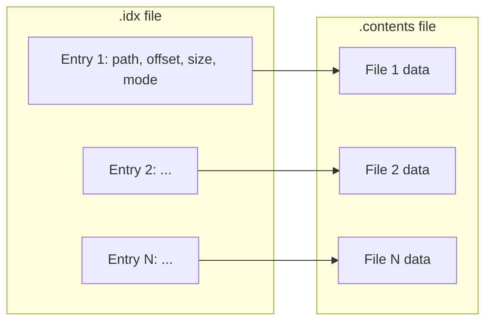
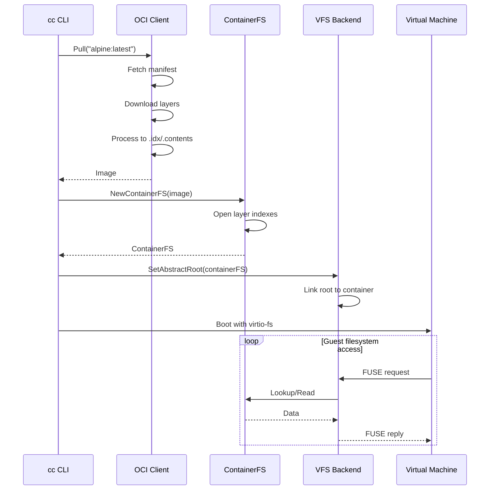

# Filesystem and OCI Support

CrumbleCracker provides container support through a virtual filesystem (VFS) backend that serves OCI container images via virtio-fs.

## Architecture Overview



## VFS Backend

**Location**: [`internal/vfs/backend.go`](../../internal/vfs/backend.go)

### Core Structure

```go
// Location: internal/vfs/backend.go:301-319
type virtioFsBackend struct {
    // Inode management
    nodes      map[uint64]*fsNode
    nodesMu    sync.RWMutex

    // Handle management
    handles    map[uint64]*fsHandle
    handlesMu  sync.RWMutex

    // Directory handles with snapshotting
    dirHandles    map[uint64]*dirHandle
    dirHandlesMu  sync.RWMutex

    // Lock tracking
    posixLocks map[uint64][]posixLock
    ofdLocks   map[uint64][]ofdLock
    lockCond   *sync.Cond
}
```

### Filesystem Node Structure

```go
// Location: internal/vfs/backend.go:347-376
type fsNode struct {
    // Identity
    ino      uint64
    parent   uint64
    name     string

    // Metadata
    mode     uint32
    uid, gid uint32
    size     uint64
    mtime    time.Time

    // Content storage (mutually exclusive)
    blocks       map[int64][]byte  // Sparse 4KB blocks
    abstractFile AbstractFile      // OR abstract backing
    abstractDir  AbstractDir
    symlink      string

    // POSIX ACL
    aclAccess  []aclEntry
    aclDefault []aclEntry
}
```

### Abstract Layer Interface

**Location**: [`internal/vfs/backend.go:240-299`](../../internal/vfs/backend.go#L240-L299)

Three interfaces enable pluggable filesystem sources:

```go
type AbstractFile interface {
    ReadAt(p []byte, off int64) (int, error)
    WriteAt(p []byte, off int64) (int, error)
    Truncate(size int64) error
}

type AbstractDir interface {
    ReadDir() ([]AbstractDirEntry, error)
    Lookup(name string) (AbstractDirEntry, error)
}

type AbstractSymlink interface {
    Target() string
}

type AbstractOwner interface {
    Owner() (uid, gid uint32)
}
```

### FUSE Operations

**Location**: [`internal/vfs/backend.go:1080-2615`](../../internal/vfs/backend.go#L1080-L2615)

| Operation | Lines | Description |
|-----------|-------|-------------|
| Lookup | 1102-1117 | Path traversal with abstract support |
| Create | 1454-1532 | File creation with ACL inheritance |
| Open | 1119-1176 | Handle management |
| Read | 1177-1285 | Data retrieval |
| Write | 1662-1681 | Copy-on-write for abstract files |
| Truncate | 1005-1056 | Sparse file handling |
| Mkdir | 1534-1600 | Directory creation |
| Symlink | 2500-2530 | Symlink creation |
| ReadDir | 1179-1285 | Directory enumeration |

### Copy-on-Write Mechanism

**Location**: [`internal/vfs/backend.go:860-925`](../../internal/vfs/backend.go#L860-L925)



## OCI Client

**Location**: [`internal/oci/client.go`](../../internal/oci/client.go)

### Client Structure

```go
// Location: internal/oci/client.go:45-86
type Client struct {
    cacheDir   string
    httpClient *http.Client
}

func NewClient(cacheDir string) *Client
```

### Authentication Flow



**Location**: [`internal/oci/client.go:115-216`](../../internal/oci/client.go#L115-L216)

### Caching Strategy

**Location**: [`internal/oci/client.go:241-329`](../../internal/oci/client.go#L241-L329)

Three-level cache:



## Image Pulling

### Manifest Handling

**Location**: [`internal/oci/image.go:173-231`](../../internal/oci/image.go#L173-L231)

Supports multiple manifest formats:

| Format | Content-Type | Description |
|--------|--------------|-------------|
| Docker v2 | application/vnd.docker.distribution.manifest.v2+json | Standard Docker format |
| OCI Index | application/vnd.oci.image.index.v1+json | Multi-arch manifest |
| Docker v1 | application/vnd.docker.distribution.manifest.v1+json | Legacy format |

### Architecture Selection

**Location**: [`internal/oci/image.go:138-194`](../../internal/oci/image.go#L138-L194)



### Layer Processing

**Location**: [`internal/oci/image.go:296-503`](../../internal/oci/image.go#L296-L503)



**Whiteout Semantics**:
- `.wh.<name>`: Marks deletion of `<name>` from lower layers
- `.wh..wh..opq`: Opaque directory marker (no inherited children)

### Indexed Archive Format

**Location**: [`internal/archive/archive.go`](../../internal/archive/archive.go)

Each layer produces two files:

| File | Content |
|------|---------|
| `{hash}.idx` | Entry metadata with offsets |
| `{hash}.contents` | Concatenated file data |



## ContainerFS

**Location**: [`internal/oci/container.go`](../../internal/oci/container.go)

### Structure

```go
// Location: internal/oci/container.go:16-21
type ContainerFS struct {
    image        *Image
    layerIndexes []*archive.Index
    layerReaders []io.ReaderAt
}
```

### Layer Stacking

**Location**: [`internal/oci/container.go:47-101`](../../internal/oci/container.go#L47-L101)

```mermaid
graph TB
    subgraph "Layer Order (bottom to top)"
        L1[Layer 1: base]
        L2[Layer 2: adds /usr]
        L3[Layer 3: modifies /etc]
    end

    subgraph "Union View"
        Root[/]
        Usr[/usr]
        Etc[/etc]
    end

    L1 --> Root
    L2 --> Usr
    L3 --> Etc
```

**Lookup Algorithm**:
1. Search layers top-to-bottom
2. Return first match
3. Detect whiteouts (deleted entries)
4. Synthesize implicit directories

### Symlink Resolution

**Location**: [`internal/oci/container.go:184-252`](../../internal/oci/container.go#L184-L252)

```go
// Up to 40 hops to prevent infinite loops
func (fs *ContainerFS) ResolvePath(path string) (string, error) {
    for hops := 0; hops < 40; hops++ {
        entry, err := fs.Lookup(path)
        if err != nil {
            return "", err
        }
        if !entry.IsSymlink() {
            return path, nil
        }
        target := entry.Target()
        if filepath.IsAbs(target) {
            path = target
        } else {
            path = filepath.Join(filepath.Dir(path), target)
        }
    }
    return "", errors.New("too many symlink hops")
}
```

## Runtime Configuration

**Location**: [`internal/oci/types.go`](../../internal/oci/types.go)

```go
type RuntimeConfig struct {
    Layers       []string          // Layer digests (ordered)
    Env          []string          // Environment variables
    Entrypoint   []string          // Default executable
    Cmd          []string          // Default arguments
    WorkingDir   string            // Working directory
    User         string            // User name or UID[:GID]
    UID          *int              // Resolved numeric UID
    GID          *int              // Resolved numeric GID
    Labels       map[string]string // Image labels
    Architecture string            // Target architecture
}
```

### Command Resolution

```go
func (img *Image) Command(overrideCmd []string) []string {
    if len(overrideCmd) > 0 {
        if len(img.Config.Entrypoint) > 0 {
            return append(img.Config.Entrypoint, overrideCmd...)
        }
        return overrideCmd
    }
    return append(img.Config.Entrypoint, img.Config.Cmd...)
}
```

### User Resolution

**Location**: [`internal/oci/local.go:84-141`](../../internal/oci/local.go#L84-L141)

For non-numeric usernames:
1. Read `/etc/passwd` from container
2. Parse `username:x:uid:gid:...`
3. Cache in `Image.Config.UID/GID`

## Integration Flow

### Container Startup



### Special Files Injection

**Location**: [`internal/vfs/backend.go:2756-2945`](../../internal/vfs/backend.go#L2756-L2945)

```go
// Add kernel modules for modprobe support
fsBackend.AddKernelModules(kernelVersion, moduleFiles)

// Add custom files
fsBackend.AddAbstractFile("/etc/resolv.conf", resolvConfReader)
fsBackend.AddAbstractDir("/dev", devDirProvider)
```

## Design Decisions and Tradeoffs

### Indexed Archives vs Standard Tar

**Decision**: Custom two-file format (.idx + .contents).

**Rationale**:
- Enables mmap-like random access
- No decompression for reads
- Efficient offset lookups

**Tradeoff**: Non-standard format, requires custom tooling.

### Deterministic Inode Assignment

**Location**: [`internal/vfs/backend.go:597-666`](../../internal/vfs/backend.go#L597-L666)

**Decision**: Snapshot directory entries on first read, materialize in sorted order.

**Rationale**:
- Stable inodes across container restarts
- Handles pagination boundaries correctly

**Tradeoff**: Extra materialization pass during OPENDIR/READDIR.

### POSIX ACL Support

**Location**: [`internal/vfs/backend.go:50-213`](../../internal/vfs/backend.go#L50-L213)

**Decision**: Full POSIX ACL xattr parsing and inheritance.

**Rationale**:
- xfstests compatibility
- Realistic permission semantics

**Tradeoff**: ~300 lines of ACL manipulation code.

### Lock Tracking (POSIX vs OFD)

**Location**: [`internal/vfs/backend.go:313-318`](../../internal/vfs/backend.go#L313-L318)

**Decision**: Track both POSIX and OFD locks separately.

**Rationale**:
- POSIX locks: per-process, released on any fd close
- OFD locks: per file-description, tied to specific handle

**Tradeoff**: Complex lock state machine.

### Copy-on-Write for Abstract Files

**Decision**: Materialize full file content on first write.

**Rationale**:
- Enables writable containers from immutable layers
- Simple implementation

**Tradeoff**: Memory overhead for large modified files.

## Performance Considerations

### Layer Index Caching

Layer `.idx` files are memory-mapped for fast lookups.

### Content Streaming

`.contents` files are accessed via `ReadAt()` for streaming reads without full load.

### Directory Snapshotting

**Location**: [`internal/vfs/backend.go:1305-1356`](../../internal/vfs/backend.go#L1305-L1356)

Directory contents are snapshotted on OPENDIR for stable iteration.

## Next Steps

- [Boot & Init System](./06-boot-init.md) - Guest initialization
- [Chipset & IR](./07-chipset-ir.md) - Device routing and code generation
