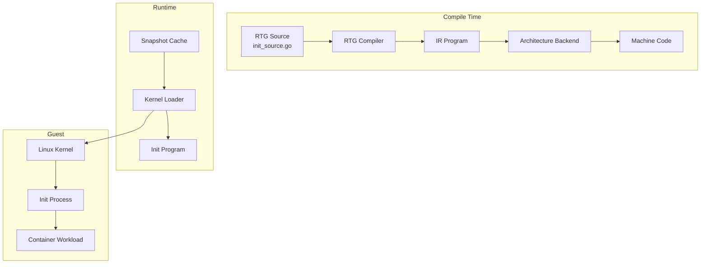
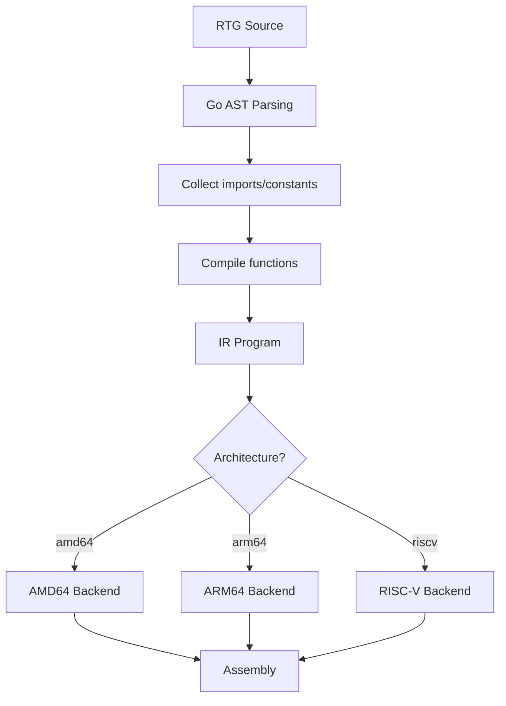
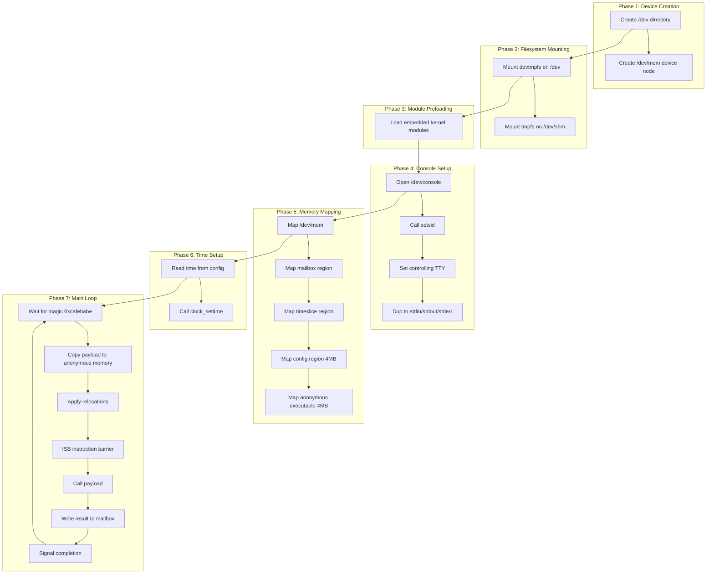
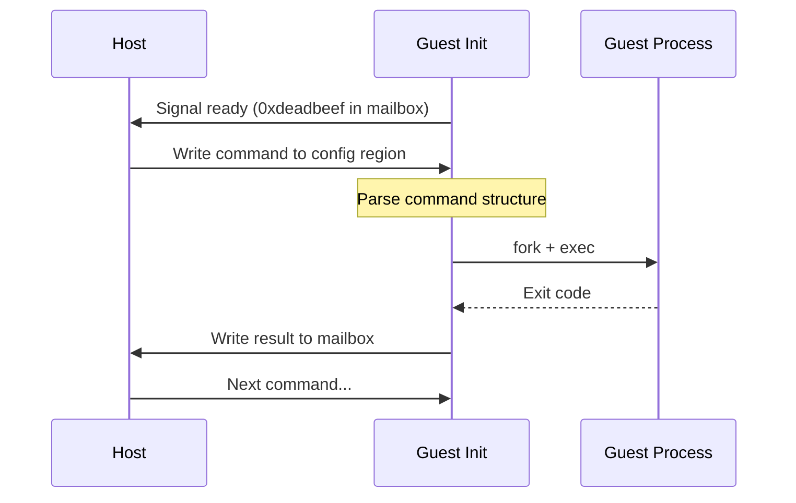
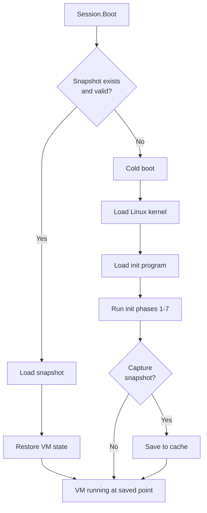

# Boot and Init System

CrumbleCracker uses a custom init system generated at compile-time through RTG (Runtime Textual Generation), enabling fast container startup with snapshot support.

## Architecture Overview



## Kernel Loading

**Location**: [`internal/initx/loader.go`](../../internal/initx/loader.go)

### Loader Configuration

```go
// Location: internal/initx/loader.go:896-1047
type VMConfig struct {
    CPUCount      int
    MemorySize    uint64
    MemoryBase    uint64        // ARM64: 0x80000000, x86: 0x0
    KernelLoader  KernelLoader
    Callbacks     VMCallbacks
}
```

### Architecture-Specific Defaults

| Setting | x86_64 | ARM64 |
|---------|--------|-------|
| Memory Base | 0x0 | 0x80000000 |
| Console | ttyS0 (serial) | hvc0 (virtio) |
| Early Console | uart8250,io,0x3f8 | uart,mmio,0x09000000 |
| Reboot Command | RESTART | POWER_OFF |

### Kernel Command Line

**Location**: [`internal/initx/loader.go:1000-1046`](../../internal/initx/loader.go#L1000-L1046)

```go
// x86_64
cmdline := "console=ttyS0,115200n8 earlycon=uart8250,io,0x3f8 " +
           "tsc=reliable tsc_early_khz=3000000"

// ARM64
cmdline := "console=hvc0 earlycon=uart,mmio,0x09000000,115200 " +
           "iomem=relaxed"
```

### Module Preloading

**Location**: [`internal/initx/loader.go:946-990`](../../internal/initx/loader.go#L946-L990)

Essential modules are embedded into the init program:
- `VIRTIO_MMIO`, `VIRTIO_BLK`, `VIRTIO_NET`
- `VIRTIO_CONSOLE`, `VIRTIO_FS`, `PACKET`
- GPU modules (conditional)
- binfmt_misc modules (conditional)

## RTG (Runtime Textual Generation)

**Location**: [`internal/rtg/rtg.go`](../../internal/rtg/rtg.go)

RTG is a front-end compiler that translates a restricted Go dialect to IR.

### Supported Constructs

| Feature | Example | Notes |
|---------|---------|-------|
| Functions | `func main() { ... }` | No methods/generics |
| Variables | `var x int64` | Single-value init |
| Control Flow | `if`, `else`, `for`, `goto` | No init/post in for |
| Syscalls | `runtime.Syscall(...)` | Direct syscall |
| Memory | `runtime.Load64()`, `runtime.Store32()` | 8/16/32/64-bit |
| Printf | `runtime.Printf("x=%d", x)` | Formatted output |
| Buffers | `var buf [1024]byte` | Stack allocated |
| Embed | `runtime.EmbedString("...")` | Inline constants |

### Compile-Time Conditionals

```go
// Architecture check
if runtime.GOARCH == "arm64" {
    // ARM64-specific code
}

// Feature flag
if runtime.Ifdef("GPU_SUPPORT") {
    // GPU initialization
}

// Configuration value
mode := runtime.Config("mode")
```

### Compilation Pipeline



## IR (Intermediate Representation)

**Location**: [`internal/ir/`](../../internal/ir/)

### Fragment Types

```go
// Location: internal/ir/common.go
type Fragment interface{}

// Variables
type Var string
type GlobalVar string
type Int64 int64
type Int32 int32

// Memory access
type MemVar struct {
    Name   string
    Width  int    // 8, 16, 32, 64
    Disp   int64  // Displacement
}

// Control flow
type IfFragment struct {
    Condition Condition
    Then      Block
    Else      Block
}

type GotoFragment struct {
    Label string
}

// Operations
type OpFragment struct {
    Op    Op        // Add, Sub, Mul, Div, Shr, Shl, And, Or, Xor
    Left  Fragment
    Right Fragment
}

type SyscallFragment struct {
    Number int
    Args   []Fragment
}
```

### Architecture Backends

| Backend | Location | ABI |
|---------|----------|-----|
| AMD64 | [`internal/ir/amd64/`](../../internal/ir/amd64/) | System V AMD64 |
| ARM64 | [`internal/ir/arm64/`](../../internal/ir/arm64/) | AAPCS64 |
| RISC-V | [`internal/ir/riscv/`](../../internal/ir/riscv/) | RISC-V LP64 |

### Register Allocation (AMD64)

**Location**: [`internal/ir/amd64/compiler.go:18-37`](../../internal/ir/amd64/compiler.go#L18-L37)

```go
// Function parameters
var paramRegisters = []asm.Variable{
    RDI, RSI, RDX, RCX, R8, R9,
}

// Syscall arguments (note: R10 instead of RCX)
var syscallArgRegisters = []asm.Variable{
    RDI, RSI, RDX, R10, R8, R9,
}

// Available for allocation
var initialFreeRegisters = []asm.Variable{
    RAX, RCX, RDX, R8, R9, R10, R11,
}
```

### Register Allocation (ARM64)

**Location**: [`internal/ir/arm64/compiler.go:18-55`](../../internal/ir/arm64/compiler.go#L18-L55)

```go
// Function parameters (8 registers vs x86's 6)
var paramRegisters = []asm.Variable{
    X0, X1, X2, X3, X4, X5, X6, X7,
}

// Available for allocation (16 registers)
var initialFreeRegisters = []asm.Variable{
    X0, X1, X2, X3, X4, X5, X6, X7,
    X8, X9, X10, X11, X12, X13, X14, X15,
}
```

## Init Process

### Regular Init

**Location**: [`internal/initx/init_source.go`](../../internal/initx/init_source.go)

Seven-phase initialization:



### Container Init

**Location**: [`internal/initx/container_init_source.go`](../../internal/initx/container_init_source.go)

Extended variant with:
- Virtiofs root mounting at `/mnt`
- pivot_root or chroot fallback
- Additional filesystem mounts (proc, sys, devpts)
- Network configuration (optional)
- QEMU emulation setup (optional)
- Privilege dropping (optional)
- Command loop mode (optional)

### Command Loop Mode



**Command Format** (at config offset 0x100000):

```
Offset 0:  Magic (0x434D4452 = "CMDR")
Offset 4:  path_len (uint32)
Offset 8:  argc (uint32)
Offset 12: envc (uint32)
Offset 16: path\0 + args\0...\0 + envs\0...\0
```

## Snapshot Support

### Snapshot Cache

**Location**: [`internal/initx/snapshot_cache.go`](../../internal/initx/snapshot_cache.go)

```go
type SnapshotCache struct {
    cacheDir string
}

func (c *SnapshotCache) GetSnapshotPath(hash []byte) string
func (c *SnapshotCache) IsValid(hash []byte, refTime time.Time) bool
func (c *SnapshotCache) SaveSnapshot(hash []byte, snap hv.Snapshot) error
func (c *SnapshotCache) LoadSnapshot(hash []byte) (hv.Snapshot, error)
```

### Cache Validity

Snapshots are invalidated when:
- Cache file doesn't exist
- Snapshot ModTime is before reference time (kernel modification time)

```go
// Location: internal/initx/snapshot_cache.go:37-46
func (c *SnapshotCache) IsValid(hash []byte, refTime time.Time) bool {
    path := c.GetSnapshotPath(hash)
    info, err := os.Stat(path)
    if err != nil {
        return false
    }
    return info.ModTime().After(refTime)
}
```

### Boot Flow with Snapshots



## MMIO Regions

### Dynamic Allocation

**Location**: [`internal/initx/loader.go:1064-1108`](../../internal/initx/loader.go#L1064-L1108)

```go
// Mailbox region (0x1000 bytes)
mailboxAlloc, _ := vm.AllocateMMIO(hv.MMIOAllocationRequest{
    Name:      "initx-mailbox",
    Size:      mailboxRegionSize,
    Alignment: 0x1000,
})

// Config region (4MB)
configAlloc, _ := vm.AllocateMMIO(hv.MMIOAllocationRequest{
    Name:      "initx-config",
    Size:      configRegionSize,
    Alignment: 0x1000,
})
```

### Device Tree Nodes (ARM64)

**Location**: [`internal/initx/loader.go:181-205`](../../internal/initx/loader.go#L181-L205)

```dts
initx-mailbox@{address} {
    compatible = "tinyrange,initx-mailbox";
    reg = <{address} 0x1000>;
    status = "okay";
};

initx-config@{address} {
    compatible = "tinyrange,initx-config";
    reg = <{address} 0x400000>;
    status = "okay";
};
```

## Design Decisions and Tradeoffs

### RTG vs Embedded Assembly

**Decision**: Use RTG (Go-like syntax) instead of raw assembly.

**Rationale**:
- Single source for multiple architectures
- Type-safe syscall wrappers
- IDE completion and error checking
- Compile-time address injection

**Tradeoff**: Additional compilation step, limited to RTG constructs.

### Mailbox vs Config Region Split

**Decision**: Separate small mailbox (0x1000) from large config region (4MB).

**Rationale**:
- Mailbox: High-frequency signaling (exit codes, yields)
- Config: Bulk data (payloads, commands)

**Tradeoff**: Two regions to manage.

### Dynamic MMIO Allocation

**Decision**: Allocate MMIO addresses at runtime instead of hardcoding.

**Rationale**:
- No conflicts with guest kernel MMIO
- Different hypervisors can use different ranges
- Addresses injected into RTG via compile options

**Tradeoff**: More complex boot setup.

### Snapshot Modes

**Decision**: Support both early (post-boot) and late (waiting init) snapshots.

**Early Snapshot**:
- Fastest startup
- Captures init after phase 6

**Late Snapshot with Command Loop**:
- Reusable base images
- Init waits at command loop
- Commands sent via config region

**Tradeoff**: Two strategies to maintain.

### Module Preloading

**Decision**: Embed kernel modules in init program.

**Rationale**:
- No filesystem access needed
- Modules loaded before guest filesystem
- Essential for virtio devices

**Tradeoff**: Binary size increase.

## Performance Characteristics

| Operation | Time | Notes |
|-----------|------|-------|
| RTG Compilation | ~10ms | Once per build |
| Cold Boot | ~500ms | Kernel + init phases |
| Snapshot Restore | ~50ms | Memory remap + state restore |
| Command Execution | ~10ms | After snapshot restore |

## Architecture-Specific Details

### x86_64

- ISB instruction is no-op
- Uses RESTART for reboot
- Serial console (ttyS0)

### ARM64

- ISB required after copying code to executable memory
- Uses POWER_OFF for reboot
- Virtio console (hvc0)
- Device tree nodes for MMIO regions

## Next Steps

- [Chipset & IR](./07-chipset-ir.md) - Device routing internals
- [Build System](./08-build-system.md) - Build tooling
