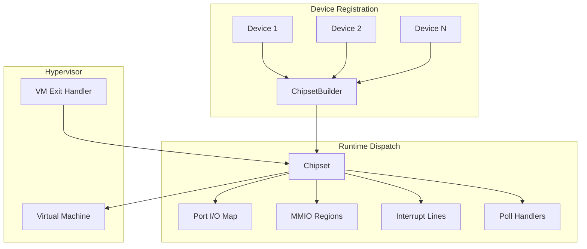
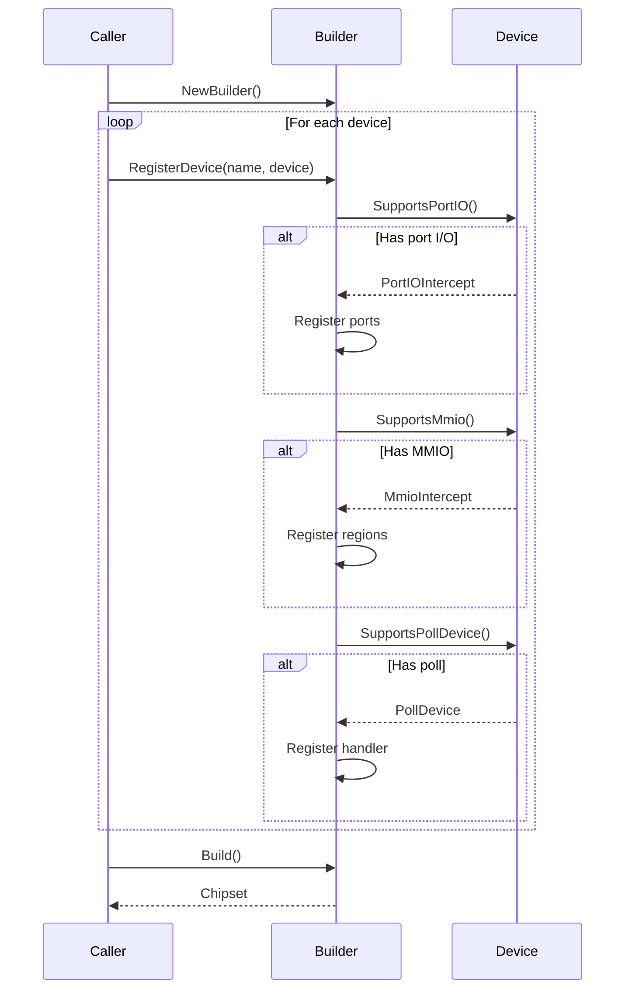
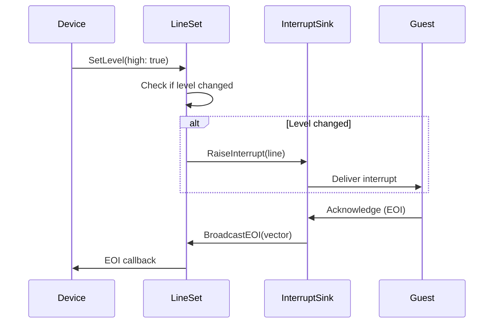
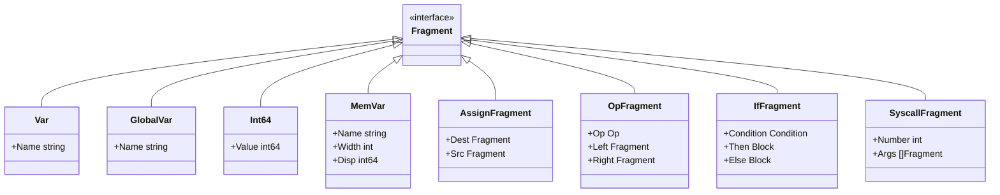
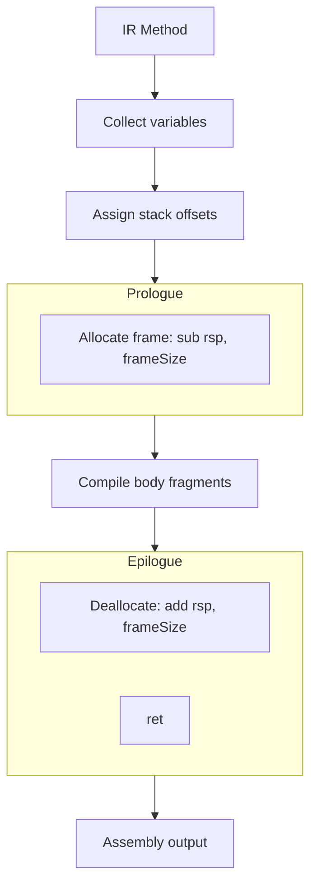

# Chipset and IR Layers

The chipset layer provides device abstraction and I/O dispatch, while the IR layer enables architecture-agnostic code generation for the init system.

## Chipset Architecture

**Location**: [`internal/chipset/`](../../internal/chipset/)



## Device Interface

**Location**: [`internal/chipset/device.go`](../../internal/chipset/device.go)

### Core Interfaces

```go
// Port I/O handler (x86 only)
type PortIOHandler interface {
    ReadIOPort(ctx hv.ExitContext, port uint16, data []byte) error
    WriteIOPort(ctx hv.ExitContext, port uint16, data []byte) error
}

// Memory-mapped I/O handler
type MmioHandler interface {
    ReadMMIO(ctx hv.ExitContext, addr uint64, data []byte) error
    WriteMMIO(ctx hv.ExitContext, addr uint64, data []byte) error
}

// Periodic maintenance
type PollHandler interface {
    Poll(ctx context.Context) error
}

// Interrupt line abstraction
type LineInterrupt interface {
    SetLevel(high bool)
    PulseInterrupt()
}

// Device lifecycle
type ChangeDeviceState interface {
    Start() error
    Stop() error
    Reset() error
}

// Unified device interface
type ChipsetDevice interface {
    hv.Device
    ChangeDeviceState
    SupportsPortIO() *PortIOIntercept
    SupportsMmio() *MmioIntercept
    SupportsPollDevice() *PollDevice
}
```

### Intercept Declarations

```go
// Port I/O intercept
type PortIOIntercept struct {
    Ports   []uint16      // Ports to intercept
    Handler PortIOHandler
}

// MMIO intercept
type MmioIntercept struct {
    Regions []MmioRegion  // Regions to intercept
    Handler MmioHandler
}

type MmioRegion struct {
    Address uint64
    Size    uint64
}

// Poll device
type PollDevice struct {
    Handler PollHandler
}
```

## Builder Pattern

**Location**: [`internal/chipset/builder.go`](../../internal/chipset/builder.go)

### Builder Structure

```go
type ChipsetBuilder struct {
    devices    map[string]ChipsetDevice      // Named devices
    pio        map[uint16]PortIOHandler      // Port → handler
    mmio       []mmioBinding                 // MMIO regions
    interrupts map[uint8]InterruptSink       // IRQ → sink
    polls      []PollHandler                 // Poll handlers
}

type mmioBinding struct {
    region  MmioRegion
    handler MmioHandler
}
```

### Registration Flow



### Validation

**Location**: [`internal/chipset/builder.go:48-113`](../../internal/chipset/builder.go#L48-L113)

- **Device name uniqueness**: No duplicate names
- **Port uniqueness**: No port conflicts
- **MMIO overlap detection**: Regions must not overlap
- **Null handler validation**: All handlers must be non-nil

## Chipset Dispatch

**Location**: [`internal/chipset/chipset.go`](../../internal/chipset/chipset.go)

### Dispatch Methods

```go
// Port I/O dispatch - O(1) hash lookup
func (c *Chipset) HandlePIO(ctx hv.ExitContext, port uint16,
                             data []byte, isWrite bool) error {
    handler, ok := c.pio[port]
    if !ok {
        return fmt.Errorf("no handler for port 0x%04x", port)
    }
    if isWrite {
        return handler.WriteIOPort(ctx, port, data)
    }
    return handler.ReadIOPort(ctx, port, data)
}

// MMIO dispatch - O(n) linear scan
func (c *Chipset) HandleMMIO(ctx hv.ExitContext, addr uint64,
                              data []byte, isWrite bool) error {
    accessEnd := addr + uint64(len(data))
    for _, binding := range c.mmio {
        start := binding.region.Address
        end := start + binding.region.Size
        if addr >= start && accessEnd <= end {
            if isWrite {
                return binding.handler.WriteMMIO(ctx, addr, data)
            }
            return binding.handler.ReadMMIO(ctx, addr, data)
        }
    }
    return fmt.Errorf("no handler for MMIO 0x%016x", addr)
}
```

### Lifecycle Management

**Location**: [`internal/chipset/chipset.go:80-120`](../../internal/chipset/chipset.go#L80-L120)

```go
// Devices started/stopped in sorted name order for determinism
func (c *Chipset) Start() error {
    names := make([]string, 0, len(c.devices))
    for name := range c.devices {
        names = append(names, name)
    }
    sort.Strings(names)

    for _, name := range names {
        if err := c.devices[name].Start(); err != nil {
            return err
        }
    }
    return nil
}
```

## Interrupt Routing

### LineSet

**Location**: [`internal/chipset/lineset.go`](../../internal/chipset/lineset.go)

```go
type LineSet struct {
    mu        sync.Mutex
    sink      InterruptSink           // Where to route
    eoiTarget EOITarget               // EOI handler
    lines     map[uint8]*lineState    // IRQ state
    eoi       map[uint8][]func()      // EOI callbacks
}

type lineState struct {
    high bool
}
```

### Interrupt Flow



### Line Operations

```go
// Allocate interrupt line
func (l *LineSet) AllocateLine(irq uint8) LineInterrupt

// Set interrupt level
func (line *lineInterrupt) SetLevel(high bool) {
    l.mu.Lock()
    defer l.mu.Unlock()

    state := l.lines[line.irq]
    if state.high == high {
        return  // No change
    }
    state.high = high
    l.sink.RaiseInterrupt(line.irq)
}

// Pulse interrupt (set then clear)
func (line *lineInterrupt) PulseInterrupt() {
    line.SetLevel(true)
    line.SetLevel(false)
}
```

## IR Layer

**Location**: [`internal/ir/`](../../internal/ir/)

### Program Structure

```go
type Program struct {
    Entrypoint string                   // Entry method name
    Methods    map[string]Method        // Named methods
    Globals    map[string]GlobalConfig  // Global variables
}

type Method []Fragment  // Sequence of IR fragments
type Block []Fragment   // Nested fragments
```

### Fragment Hierarchy



### Operations

```go
type Op int

const (
    OpAdd Op = iota
    OpSub
    OpMul
    OpDiv
    OpShr    // Shift right
    OpShl    // Shift left
    OpAnd
    OpOr
    OpXor
)
```

### Conditions

```go
type Condition interface{}

type CompareCondition struct {
    Kind  CompareKind  // Equal, NotEqual, Less, Greater, etc.
    Left  Fragment
    Right Fragment
}

// Helpers
func IsEqual(left, right any) Condition
func IsZero(value Fragment) Condition
func IsNegative(value Fragment) Condition
```

## Backend Registration

**Location**: [`internal/ir/arch.go`](../../internal/ir/arch.go)

```go
type Backend interface {
    BuildStandaloneProgram(p *Program) (asm.Program, error)
}

var backends = make(map[hv.CpuArchitecture]Backend)

func RegisterBackend(arch hv.CpuArchitecture, backend Backend) {
    backends[arch] = backend
}

func BuildStandaloneProgramForArch(arch hv.CpuArchitecture,
                                    prog *Program) (asm.Program, error) {
    backend, ok := backends[arch]
    if !ok {
        return nil, fmt.Errorf("no backend for %s", arch)
    }
    return backend.BuildStandaloneProgram(prog)
}
```

### Backend Registration

```go
// internal/ir/amd64/backend.go
func init() {
    ir.RegisterBackend(hv.ArchitectureAMD64, &backend{})
}

// internal/ir/arm64/backend.go
func init() {
    ir.RegisterBackend(hv.ArchitectureARM64, &backend{})
}

// internal/ir/riscv/backend.go
func init() {
    ir.RegisterBackend(hv.ArchitectureRISCV64, &backend{})
}
```

## AMD64 Backend

**Location**: [`internal/ir/amd64/`](../../internal/ir/amd64/)

### Compiler Structure

```go
type compiler struct {
    method       ir.Method
    fragments    asm.Group
    varOffsets   map[string]int32  // Stack offsets
    frameSize    int32
    freeRegs     []asm.Variable    // Available registers
    usedRegs     map[asm.Variable]bool
    paramIndex   int
    labels       map[string]asm.Label
    labelCounter int
}
```

### Calling Convention (System V AMD64)

| Parameter | Register |
|-----------|----------|
| 1 | RDI |
| 2 | RSI |
| 3 | RDX |
| 4 | RCX |
| 5 | R8 |
| 6 | R9 |
| 7+ | Stack |
| Return | RAX |

### Syscall Convention

| Argument | Register |
|----------|----------|
| Number | RAX |
| 1 | RDI |
| 2 | RSI |
| 3 | RDX |
| 4 | R10 (not RCX!) |
| 5 | R8 |
| 6 | R9 |
| Return | RAX |

### Code Generation Flow



## ARM64 Backend

**Location**: [`internal/ir/arm64/`](../../internal/ir/arm64/)

### Differences from AMD64

| Aspect | AMD64 | ARM64 |
|--------|-------|-------|
| Param registers | 6 (RDI-R9) | 8 (X0-X7) |
| Free registers | 7 | 16 |
| Link register | Implicit (stack) | X30 (must save) |
| ISB instruction | No-op | Required |

### Link Register Handling

```go
// If method makes calls, save LR
func (c *compiler) emitPrologue() {
    if c.hasCalls {
        c.emit(STP(X29, X30, SP, -16))  // Save FP and LR
        c.emit(MOV(X29, SP))            // Set frame pointer
    }
}

func (c *compiler) emitEpilogue() {
    if c.hasCalls {
        c.emit(LDP(X29, X30, SP, 16))   // Restore FP and LR
    }
    c.emit(RET())
}
```

## Helper Functions

**Location**: [`internal/ir/helpers.go`](../../internal/ir/helpers.go)

### Syscall Helpers

```go
type SyscallCheckedConfig struct {
    Result  Var           // Store return value
    Number  defs.Syscall
    Args    []any
    OnError Fragment      // Error handler
}

// Expands to: result = syscall(...); if result < 0 { onError }
func SyscallChecked(cfg SyscallCheckedConfig) Fragment
```

### Stack Slots

```go
type StackSlot struct {
    id   uint64
    size int64
}

type StackSlotConfig struct {
    Size int64
    Body func(StackSlot) Fragment
}

func WithStackSlot(cfg StackSlotConfig) Fragment

// Stack slot methods
func (s StackSlot) Base() MemoryFragment      // Memory at base
func (s StackSlot) At(disp int64) MemoryFragment
func (s StackSlot) Pointer() Fragment         // Address of slot
```

### Constant Data

```go
type ConstantBytesConfig struct {
    Target        asm.Variable
    Data          []byte
    ZeroTerminate bool
    Length        Var
    Pointer       Var
}

func LoadConstantBytesConfig(cfg ConstantBytesConfig) Fragment
```

## Design Decisions and Tradeoffs

### Immutable Chipset

**Decision**: Build chipset once, never modify.

**Rationale**:
- No synchronization during dispatch
- Deterministic device ordering

**Tradeoff**: Cannot add devices at runtime.

### O(1) PIO vs O(n) MMIO

**Decision**: Hash lookup for ports, linear scan for MMIO.

**Rationale**:
- Ports are small integers (good hash keys)
- MMIO regions can overlap (need containment check)
- MMIO typically has fewer regions

**Tradeoff**: MMIO lookup slower with many regions.

### Ordered Device Lifecycle

**Decision**: Start/stop devices in sorted name order.

**Rationale**:
- Deterministic initialization sequence
- Reproducible behavior

**Tradeoff**: Requires consistent naming.

### Fragment-Based IR

**Decision**: Union type via `interface{}` with type switches.

**Rationale**:
- Simple to add new fragment types
- Easy to traverse/transform

**Tradeoff**: No compile-time exhaustiveness checking.

### Backend Plugin Registration

**Decision**: Backends register via `init()` functions.

**Rationale**:
- No import cycles
- Automatic registration on import

**Tradeoff**: Registration order not guaranteed.

### No IR Optimization

**Decision**: Direct IR-to-assembly without optimization passes.

**Rationale**:
- Init code is small
- Compile speed more important
- RTG does constant folding

**Tradeoff**: Less optimal code generation.

## Integration Example

```go
// Build IR program
prog := &ir.Program{
    Entrypoint: "main",
    Methods: map[string]ir.Method{
        "main": ir.Method{
            ir.Assign(ir.Var("x"), ir.Int64(42)),
            ir.Assign(ir.Var("x"),
                ir.Op(ir.OpAdd, ir.Var("x"), ir.Int64(1))),
            ir.Printf("x=%ld\n", ir.Var("x")),
        },
    },
}

// Compile for architecture
asm, err := ir.BuildStandaloneProgramForArch(hv.ArchitectureAMD64, prog)
```

## Next Steps

- [Build System](./08-build-system.md) - Build tooling and test infrastructure
