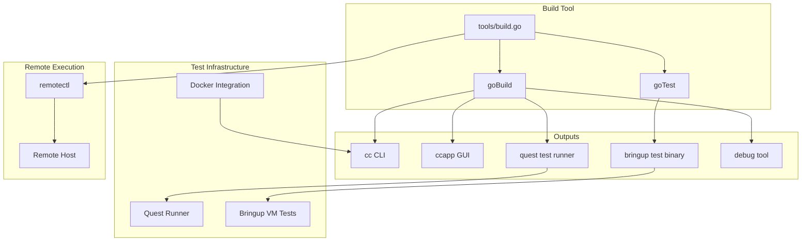
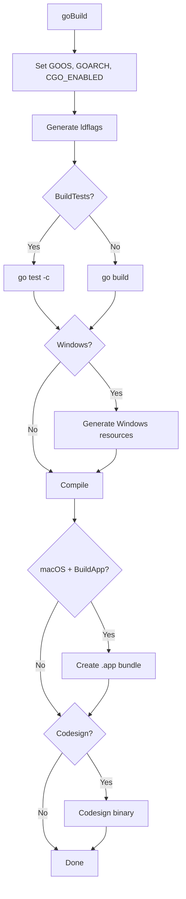
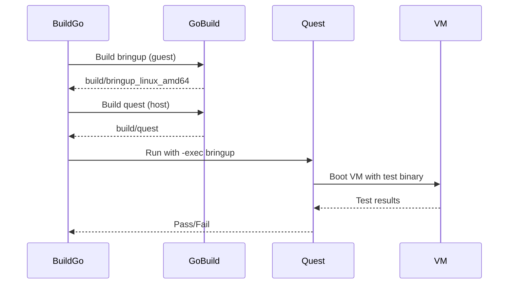
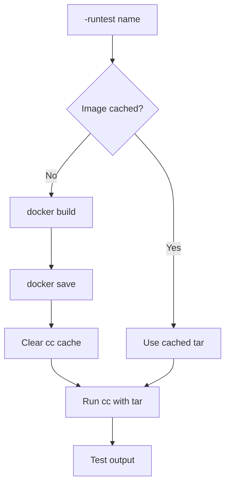
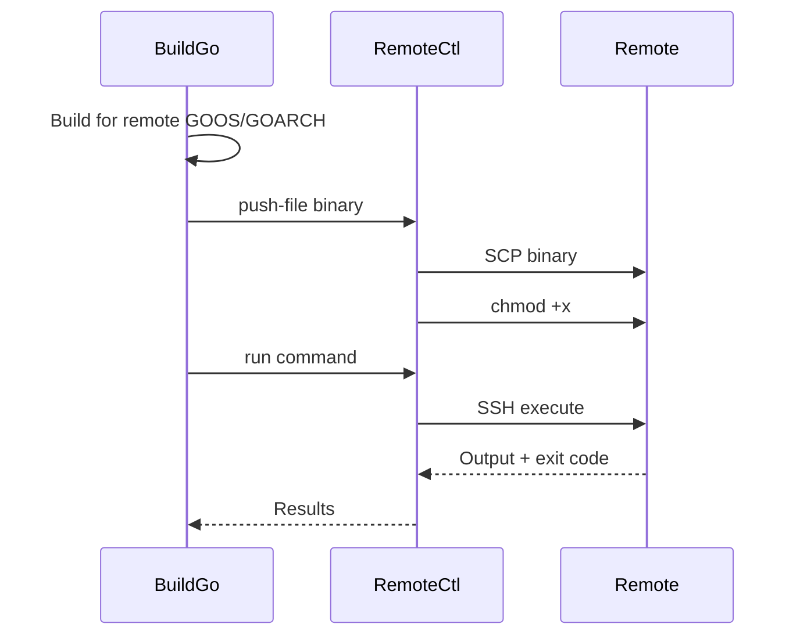
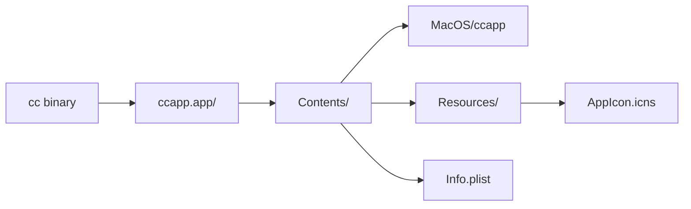

# Build System

CrumbleCracker uses a self-executing Go script (`tools/build.go`) as the primary build tool, providing unified build, test, and release workflows.

## Architecture Overview



## Core Build Functions

**Location**: [`tools/build.go`](../../tools/build.go)

### Build Options

```go
// tools/build.go:66-84
type buildOptions struct {
    Tags        []string    // Build tags
    LdFlags     []string    // Linker flags
    BuildTests  bool        // Build test binary
    BuildApp    bool        // Build app bundle
    CgoEnabled  bool        // Enable CGO
    Race        bool        // Enable race detector
    Profile     string      // CPU profile output
    MemProfile  string      // Memory profile output
}
```

### goBuild Function

**Location**: [`tools/build.go:486-597`](../../tools/build.go#L486-L597)



### Version Injection

**Location**: [`tools/build.go:1068-1086`](../../tools/build.go#L1068-L1086)

```go
func getVersion() string {
    // 1. Check GITHUB_REF_NAME (CI/CD)
    if v := os.Getenv("GITHUB_REF_NAME"); v != "" {
        return v
    }

    // 2. Try git describe
    cmd := exec.Command("git", "describe", "--tags", "--always")
    if out, err := cmd.Output(); err == nil {
        return strings.TrimSpace(string(out))
    }

    // 3. Default
    return "dev"
}
```

Injected via ldflags:
```
-X github.com/tinyrange/cc/cmd/ccapp.Version={version}
```

## Build Targets

### cc CLI

```bash
./tools/build.go           # Build cc to build/cc
./tools/build.go -run -- alpine  # Build and run
```

**Location**: [`internal/cmd/cc/`](../../internal/cmd/cc/)

### ccapp GUI

```bash
./tools/build.go -app      # Build ccapp
./tools/build.go -app -- [args]  # Build and run
```

**Location**: [`cmd/ccapp/`](../../cmd/ccapp/)

### Debug Tool

```bash
./tools/build.go -dbg-tool -- [args]  # Build and run debug tool
```

**Location**: [`cmd/debug/`](../../cmd/debug/)

## Test Infrastructure

### Quest (Hypervisor Tests)

**Location**: [`internal/cmd/quest/`](../../internal/cmd/quest/)

```bash
./tools/build.go -quest           # Run hypervisor tests
./tools/build.go -quest -- -linux # With Linux boot test
./tools/build.go -quest -- -arch arm64
```

Quest validates:
- Hypervisor initialization (x86_64/ARM64/RISC-V)
- Linux kernel boot smoke test
- IOAPIC and interrupt handling
- IPI (Inter-Processor Interrupt) testing

### Bringup (Guest Tests)

**Location**: [`internal/cmd/bringup/`](../../internal/cmd/bringup/)

```bash
./tools/build.go -bringup         # Run filesystem/networking tests
```

Two-phase build:
1. Build guest test binary (Linux target, `["guest"]` tags)
2. Build quest runner (host platform)
3. Run quest with `-exec` pointing to guest binary



### Bringup GPU (Graphics Tests)

**Location**: [`internal/cmd/bringup-gpu/`](../../internal/cmd/bringup-gpu/)

```bash
./tools/build.go -bringup-gpu     # Run GPU/input tests
```

Same two-phase build, adds `-gpu` flag to quest.

### Go Unit Tests

```bash
./tools/build.go -test ./...           # All packages
./tools/build.go -test ./internal/netstack  # Single package
```

### Docker Integration Tests

**Location**: [`tests/`](../../tests/)

```bash
./tools/build.go -runtest hello   # Build and run tests/hello
./tools/build.go -runtest sway -- -exec -gpu
```

Available tests:
- `hello` - Basic container
- `linux` - Linux boot
- `gcc` - GCC compilation
- `sway` - Sway desktop
- `userperm` - User permissions
- `systemd` - Systemd init
- `apt` - APT package manager
- `fio` - Filesystem I/O
- `xfstests` - Filesystem test suite



## Cross-Compilation

### Supported Platforms

```go
// tools/build.go:51-57
var crossBuilds = []crossBuild{
    {GOOS: "linux", GOARCH: "amd64"},
    {GOOS: "windows", GOARCH: "amd64"},
    {GOOS: "linux", GOARCH: "arm64"},
    {GOOS: "darwin", GOARCH: "arm64"},
    {GOOS: "windows", GOARCH: "arm64"},
}
```

### Building for Specific Platform

```bash
./tools/build.go -os linux -arch arm64
```

### Building All Platforms

```bash
./tools/build.go -cross   # Build for all platforms
```

### Output Naming

```go
// tools/build.go:33-44
func (b crossBuild) OutputName(name string) string {
    if b.IsNative() {
        if b.GOOS == "windows" {
            return name + ".exe"
        }
        return name
    }
    // Cross-compiled: name_os_arch
    ext := ""
    if b.GOOS == "windows" {
        ext = ".exe"
    }
    return fmt.Sprintf("%s_%s_%s%s", name, b.GOOS, b.GOARCH, ext)
}
```

## Remote Execution

**Location**: [`tools/build.go:693-741`](../../tools/build.go#L693-L741)

### Configuration

Remote targets defined in `local/remotes.json`:

```json
{
    "alias": {
        "address": "user@host:port",
        "os": "linux",
        "arch": "amd64",
        "targetDir": "/tmp/cc-test"
    }
}
```

### Usage

```bash
./tools/build.go -quest -remote alias
./tools/build.go -bringup -remote alias
./tools/build.go -bringup-gpu -remote alias
```

### Remote Flow



### Constraints

- `-remote` only works with `-quest`, `-bringup`, or `-bringup-gpu`
- Cannot combine `-remote` with `-cross`

## Platform-Specific Handling

### macOS

#### App Bundle Creation

**Location**: [`tools/build.go:332-412`](../../tools/build.go#L332-L412)



#### Codesigning

**Location**: [`tools/build.go:564-586`](../../tools/build.go#L564-L586)

Built-in codesign tool (`internal/cmd/codesign`) handles:
- Binary signing
- Entitlements embedding
- Bundle signing

#### Release Workflow

**Location**: [`tools/build.go:1689-1786`](../../tools/build.go#L1689-L1786)

```bash
./tools/build.go -release
```

Steps:
1. Build app bundle
2. Sign with developer certificate
3. Notarize with Apple
4. Staple notarization ticket
5. Verify signature
6. Create DMG (optional)

### Windows

#### Resource Generation

**Location**: [`tools/build.go:417-484`](../../tools/build.go#L417-L484)

Uses `go-winres` to embed:
- Application icon
- Version information
- Manifest

#### GUI Subsystem

```go
// tools/build.go:533
ldflags = append(ldflags, "-H=windowsgui")
```

## Debug Features

### Environment Variables

| Variable | Purpose |
|----------|---------|
| `CC_DEBUG_FILE` | Binary debug log output path |
| `CC_DEBUG_MEMORY` | Buffer logs in memory |
| `CC_NETSTACK_PCAP_DIR` | Network packet capture directory |
| `CC_BRINGUP_LARGE` | Enable large bringup tests |
| `CC_BRINGUP_LARGE_ITERS` | Iteration count for large tests |

### Debug Log Analysis

```bash
# Build and run debug tool
./tools/build.go -dbg-tool -- -list local/debug.bin
./tools/build.go -dbg-tool -- -range local/debug.bin
./tools/build.go -dbg-tool -- -tail -limit 200 local/debug.bin
./tools/build.go -dbg-tool -- -source 'net' -match 'error' local/debug.bin
```

### Profiling

```bash
./tools/build.go -run -cpuprofile=cpu.prof -- alpine
./tools/build.go -run -memprofile=mem.prof -- alpine
```

## Benchmarks

**Location**: [`internal/cmd/benchmark/`](../../internal/cmd/benchmark/)

```bash
./tools/build.go -bench
```

Results stored in `benchmarks/<hostid>/benchmark_<UTC>.njson`.

## Design Decisions and Tradeoffs

### Self-Executing Go Script

**Decision**: Use `#!/usr/bin/true; exec /usr/bin/env go run "$0" "$@"` pattern.

**Rationale**:
- No separate build tool compilation
- Easy to modify and extend
- Cross-platform (Go available everywhere)

**Tradeoff**: Slower than pre-compiled tool.

### Separated Guest/Host Builds

**Decision**: Two-phase bringup builds (guest binary + quest runner).

**Rationale**:
- Guest binary runs inside VM (Linux)
- Quest runner runs on host (any platform)
- Clear separation of concerns

**Tradeoff**: More complex build logic.

### Docker for Integration Tests

**Decision**: Use Docker to build test images.

**Rationale**:
- Standard container format
- Rich ecosystem of base images
- Dockerfile syntax familiar to users

**Tradeoff**: Docker dependency for test builds.

### Caching Strategy

**Decision**: Check file modification times to skip rebuilds.

**Rationale**:
- Fast iteration during development
- Automatic cache invalidation

**Tradeoff**: Requires consistent timestamps.

### Version from Git

**Decision**: Use `git describe --tags --always`.

**Rationale**:
- Automatic version from tags
- Includes commit hash for unreleased builds
- CI/CD override via `GITHUB_REF_NAME`

**Tradeoff**: Requires git repository.

## Common Workflows

### Development

```bash
# Build and run with container
./tools/build.go -run -- alpine

# Build and run specific test
./tools/build.go -bringup

# Run unit tests
./tools/build.go -test ./internal/netstack
```

### Debugging

```bash
# Capture debug log
CC_DEBUG_FILE=local/debug.bin ./tools/build.go -bringup

# Analyze log
./tools/build.go -dbg-tool -- -tail -limit 100 local/debug.bin
```

### Release

```bash
# Build all platforms
./tools/build.go -cross

# macOS release with notarization
./tools/build.go -release
```

### Remote Testing

```bash
# Test on remote Linux machine
./tools/build.go -quest -remote linux-server
./tools/build.go -bringup -remote linux-server
```

## File Structure

```
tools/
└── build.go          # Main build script (54KB)

build/                # Output directory
├── cc                # cc CLI (native)
├── cc_linux_amd64    # cc CLI (cross-compiled)
├── ccapp.app/        # macOS app bundle
├── quest             # Test runner
├── bringup_linux_amd64  # Guest test binary
└── test-hello.tar    # Docker test image

local/
├── remotes.json      # Remote target configuration
├── hostid            # Host identifier for benchmarks
└── *.bin             # Debug logs
```

## Integration with CI/CD

### GitHub Actions

```yaml
- name: Build
  run: ./tools/build.go -cross

- name: Test
  run: ./tools/build.go -quest

- name: Release
  env:
    GITHUB_REF_NAME: ${{ github.ref_name }}
  run: ./tools/build.go -release
```

### Version Detection

Build tool automatically detects version from:
1. `GITHUB_REF_NAME` environment variable (CI/CD)
2. `git describe --tags --always` (local development)
3. `"dev"` fallback
