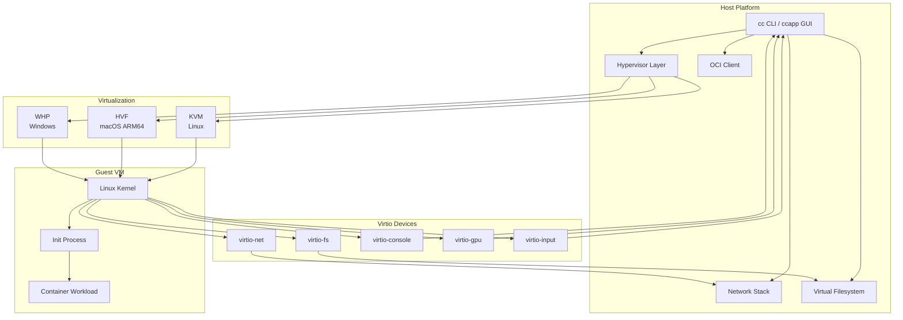

# CrumbleCracker Architecture Documentation

This directory contains comprehensive architecture documentation for CrumbleCracker, an experimental high-performance embedded virtual machine monitor (VMM) written in Go.

## Overview

CrumbleCracker enables direct host-API integration with guest Linux kernels, functioning as a virtualized OCI runtime embeddable into Go codebases. It supports multiple architectures (x86_64, ARM64, RISC-V) and multiple host platforms (Linux, macOS, Windows).



## Documentation Index

| Document | Description |
|----------|-------------|
| [Overview](./01-overview.md) | High-level system architecture and design philosophy |
| [Hypervisor Layer](./02-hypervisor.md) | KVM, HVF, WHP implementations and abstractions |
| [Virtio Devices](./03-virtio-devices.md) | Virtual device implementations (net, fs, console, gpu, input) |
| [Network Stack](./04-network-stack.md) | Custom TCP/IP stack design |
| [Filesystem & OCI](./05-filesystem-oci.md) | VFS backend and OCI container support |
| [Boot & Init System](./06-boot-init.md) | Kernel loading, RTG, and init process |
| [Chipset & IR](./07-chipset-ir.md) | Device routing and code generation |
| [Build System](./08-build-system.md) | Build tooling and test infrastructure |

## Quick Reference

### Platform Support Matrix

| Platform | Hypervisor | Architectures | Status |
|----------|------------|---------------|--------|
| Linux | KVM | x86_64, ARM64, RISC-V | Full support |
| macOS | HVF | ARM64 (Apple Silicon) | Full support |
| Windows | WHP | x86_64, ARM64 | Full support |

### Key Design Principles

1. **Minimal Dependencies**: Custom network stack, no TAP devices required
2. **Fast Startup**: Snapshot support for sub-second container boot
3. **Embeddable**: Library-first design for Go integration
4. **Cross-Platform**: Single codebase, multiple hypervisor backends
5. **OCI Compatible**: Direct container image support without Docker runtime

### Repository Structure

```
cc/
├── cmd/                    # Standalone executables
│   ├── ccapp/             # GUI application
│   ├── debug/             # Debug log inspector
│   └── ...
├── internal/              # Core library packages
│   ├── hv/                # Hypervisor abstraction
│   │   ├── kvm/          # Linux KVM implementation
│   │   ├── hvf/          # macOS HVF implementation
│   │   └── whp/          # Windows WHP implementation
│   ├── devices/           # Virtual devices
│   │   ├── virtio/       # Virtio device implementations
│   │   └── ...
│   ├── netstack/          # Network stack
│   ├── vfs/               # Virtual filesystem
│   ├── oci/               # OCI image handling
│   ├── initx/             # Init and boot system
│   ├── chipset/           # Device routing
│   ├── ir/                # Code generation IR
│   └── ...
├── tools/                 # Build and development tools
│   └── build.go          # Primary build tool
└── tests/                 # Integration tests
```

## Getting Started

See the main [README.md](../../README.md) for build and usage instructions.

## Contributing

Architecture documentation should be updated when making significant changes to:
- Core abstractions (interfaces, data structures)
- Platform support
- Device implementations
- Performance-critical paths
